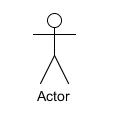
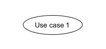
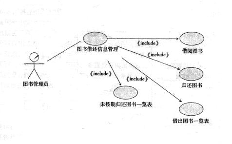
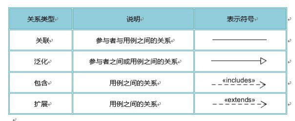
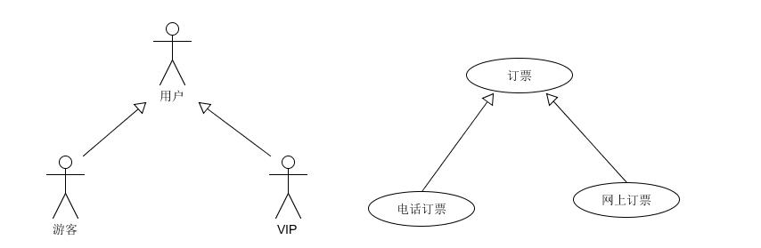
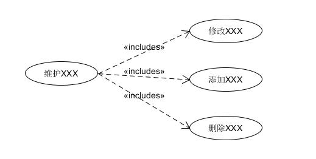
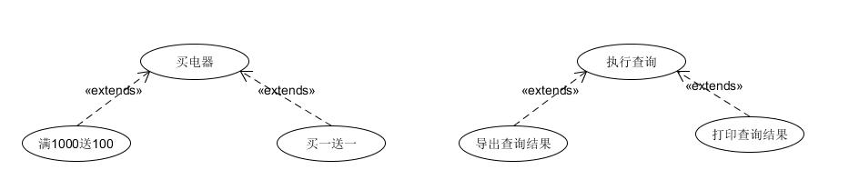
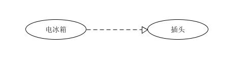
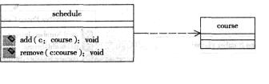

# Software Engineering 软件工程课设
:smirk_cat: 2152354 Karry

同济大学2023-2024软件工程课程设计相关课程资料与笔记，这里将包含课程内容的每周更新、课堂笔记记录和课后拓展补充，大家一起交流进步！Ohhhlaaaa:smiley_cat:

## :gorilla:Weeeeeeek 10

### 需求分析

功能性需求：

内部和外部接口，描述清晰；

非功能需求：（可以成为加分项）

* 主要考虑性能与压力，压力测试；同时最大承受多少用户而系统不瘫痪；
* 加密

### 用例图（场景图）建模 Use Case Diagram

#### 用例图包含的元素

1. **参与者(Actor)**——与应用程序或系统进行交互的用户、组织或外部系统。用一个小人表示。

   

2. **用例(Use Case)**——用例就是外部可见的系统功能，对系统提供的服务进行描述。用椭圆表示。

   

3. **子系统(Subsystem)**——用来展示系统的一部分功能，这部分功能联系紧密。

   子系统往往由一个或多个类构成，一些类可以组合变成微服务，

   图书借阅子系统，可能多个类，比如借阅图书，归还图书，阅览表生成，未按期归还表生成，这几个分别包含一些类；

   

   每个子系统定义接口类，类内通过接口去访问其他类的信息。修改的时候可以只修改接口。开发时长估计超过三周，则可以拆分故事。

#### 用例图所包含的的关系

用例图中涉及的关系有：关联、泛化、包含、扩展。如下表所示：

1. **关联(Association)**，表示参与者与用例之间的通信，任何一方都可发送或接受消息。【箭头指向】：无箭头，将参与者与用例相连接。

   

2. **泛化(Inheritance)**，就是通常理解的**继承关系**，子用例和父用例相似，但表现出更特别的行为；子用例将继承父用例的所有结构、行为和关系。子用例可以使用父用例的一些行为，也可以重载（指不同的函数使用相同的函数名，但是函数的参数个数或类型不同。调用的时候根据函数的参数来区别不同的函数）它。父用例通常是抽象的。子用例中的特殊行为都可以作为父用例中的备选流存在。【箭头指向】：指向父用例。

   

   actor之间的泛化关系，即定义父类和子类关系，为类的继承提供依据；订票如果三个类完成，电话订票和网上订票即子类，三个类分别继承下来；

3. **包含(Include)**，包含关系用来把一个较复杂用例所表示的功能分解成具有原子功能的子用例。【箭头指向】：指向分解出来的功能用例。

   

   维护可能有相关的检查，分解为原子类功能，每个原子功能就是一个story

   粒度把握！

   一个类或者一个方法，可以不作拆分。

   一般两级就足够了，当然可以多一层extend指向第二层的某个类，表示二层该类达到什么条件触发调用，事件额外的触发，不常发生，作为扩展功能。（典型的一个extend：余下内存500M提醒一次，余下200提醒一次等等）

   A 分出 A1、A2， A1是加入购物车，A2统计销售总额等等，这样拆出来的每部分功能都非常简单，则没有必要再拆分了。

   比如login类，里面有很多方法，比如手机号注册、邮箱注册、密码检查等；

   一般还有一个通用的访问数据库的类。比如select作为一个类内方法，所需要操作的内容参数化。

   如果需要两个以上的业务逻辑，通过类之间协作完成一个完整功能，那么可以考虑拆分

4. **扩展(Extend)**，扩展关系是指用例功能的延伸，相当于为基础用例提供一个附加功能。将**基础用例中一段相对独立并且可选的动作**，用扩展（Extension）用例加以封装，从而使基础用例行为更简练和目标更集中。**扩展用例为基础用例添加新的行为**。扩展用例可以访问基础用例的属性，因此它能根据基础用例中扩展点的当前状态来判断是否执行。**但是扩展用例对基础用例不可见**。对于一个扩展用例，可以在基础用例上有几个扩展点。【箭头指向】：指向基础用例。

   基础用例中偶尔触发的一些事件，设置成扩展，扩展的类方法时不时需要调用基础类方法，查看是否满足了触发条件。

   

5. **依赖(Dependency)**，以上 4 种关系是 UML 定义的标准关系。后来添加了依赖关系，用带箭头的虚线表示，表示源用例依赖于目标用例。【箭头指向】：指向被依赖项。

   

   单向访问，完全依赖

   

#### 撰写用例的脚本

另外一个最重要的—— 各个 use case 的脚本，脚本对各故事需求进行描述

每个故事需要详细用例脚本来描述，包括：

* 用例名称——表明用户的意图或用例的用途。
* 参与者——与该用例相关的参与者列表。
* 前置条件——一个条件列表，如果其中包含条件，则这些条件必须在访问用例之前得到满足。
* 后置条件——一个条件列表，如果其中包含条件，则这些条件将在用例完成以后得到满足。
* 基本事件流——描述用例中各项活动都正常进行时用例的工作方式。（系统异常网络异常应该是基本事件流内非预知性错误下该处理的）
* 分支事件流——描述用例中某项活动的子活动各项工作都正常进行时用例的工作式。
* 异常事件流——描述用例的变更工作方式，以及出现异常或发生错误的情况下所执行的路径。（最重要的是异常流，根据需求调研时结果确定，验收测试时需要检测的，查看系统此时是否可以正确应对，这些错误应该是可预知出现的一些错误，不是不可预知的如系统错误网络异常之类）

**例：图书管理系统中登陆和借阅两个用例的脚本描述**

**1．系统登录用例**

用例名称：系统登录

参与者：图书管理员

1.1 前置条件

无

1.2 后置条件

如果用例成功，参与者可以启动应用系统，使用系统提供的功能。反之，系统的状态不发生变化。

1.3 基本事件流

当图书管理员登录系统时，用例启动。

1. 系统提示用户输入用户名和密码。
2. 用户输入用户名和密码。
3. 系统验证输入的用户名和密码，若正确，则用户登录到系统中。

1.4 异常事件流

如果用户输入无效的用户名／密码，则系统显示错误信息。用户可以选择返回基本事件流的起始点，重新输入正确的用户名／密码；或者取消登录，用例结束。

**2．图书借阅**

用例名称：借阅图书

参与者：读者，图书管理员

2.1 前置条件

在这个用例开始之前，图书管理员必须登录到系统；否则，系统的状态不发生变化。

2.2 后置条件

如果这个用例成功实现，则在系统中创建并存储借阅记录。

2.3 基本事件流

当读者借阅图书时，用例启动。

1. 登录系统。
2. 输人图书 ID 和读者 ID。
3. 检索读者 ID。
4. 检索图书 ID。
5. 根据时间算法确定图书借出日期和归还日期。
6. 图书馆将图书借给读者。
7. 创建借阅记录。
8. 存储借阅记录。

2.4 异常事件流

1. 如果读者未注册，则系统显示提示信息，用例被终止。
2. 如果要借图书不存在，系统显示提示信息，用例被终止。
3. 如果要借图书都已借出，则系统提示信息，用例被终止。

需求规约

文字描述需求

what to do

需求分析建模

功能从数据的角度抽象，构建CRC 或者说类图

activity diagram抽象不同层面的

系统层面流程抽象出来

每条子系统流程抽象出来

每个类、子系统抽象出来

方法级别类级别一般到详细设计做

实体类 边界 接口类

controler 怎么定义？
