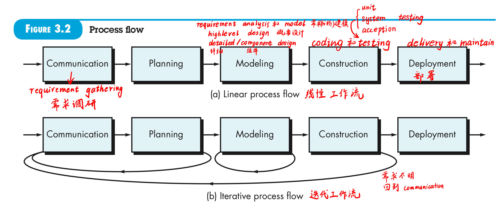
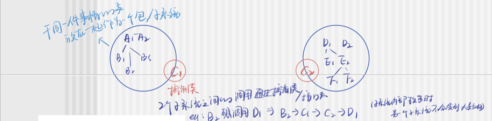
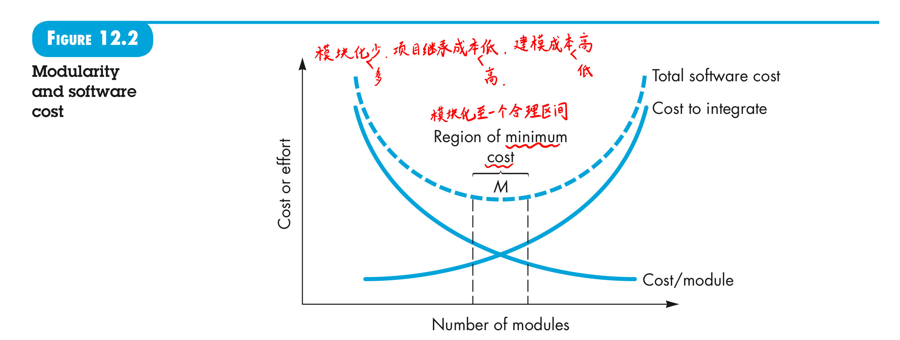

# 软件工程 实践者的研究方法

[TOC]

| 日期     | 进度                                | 复习总结 |
| -------- | ----------------------------------- | -------- |
|          |                                     |          |
|          |                                     |          |
| 10月16日 | 2.3 软件工程实践 - 3.2 定义框架活动 |          |
| 10月23日 | 3.3 明确任务集 - 3.5 过程评估与改进 |          |
| 10月30日 | 过程模型                            |          |
| 11月1日  | 过程模型 scrum                      |          |
| 11月6日  | 极限编程                            |          |
| 11月13日 | 敏捷开发                            |          |
| 11月15日 |                                     |          |

每个章节可能包含的重点内容和复习要点：

1. **Chapter 01 - 软件的本质**:
   - 理解软件的定义、特性和类型。
   - 掌握软件的挑战和影响软件工程的趋势。

2. **Chapter 02 - 软件工程**:
   - 了解软件工程的目标和原则。
   - 讨论软件工程的各个领域，如开发、项目管理、维护等。

3. **Chapter 03 - 软件过程**:
   - 熟悉软件开发过程的基本概念和阶段。
   - 掌握软件过程模型的作用和意义。

4. **Chapter 04 - 过程模型**:
   - 深入理解瀑布模型、增量模型、螺旋模型和其他常见过程模型。
   - 讨论每种模型的优缺点和适用场景。

5. **Chapter 05 - 敏捷开发**:
   - 掌握敏捷方法的核心价值和原则。
   - 了解敏捷开发流程和实践，如Scrum和极限编程（XP）。

6. **Chapter 07 - 软件工程实践原则**:
   - 理解构建可靠软件所需的原则和实践。
   - 审查代码复用、重构和配置管理等实践。

7. **Chapter 08 - 需求**:
   - 学习需求工程过程，包括需求的收集、分析、规格化和验证。
   - 讨论如何处理需求变更和优先排序。

8. **Chapter 09 - 需求建模：场景建模**:
   - 掌握用例图的作用和创建方法。
   - 理解如何通过场景来确定和描述系统功能。

9. **Chapter 10 - 需求建模：类的建模**:
   - 学习创建和使用类图来表现系统的静态结构。
   - 理解类、对象、属性和方法的概念。

10. **Chapter 11 - 需求模型：行为,模式和Web_Mobile应用**:
    - 了解行为模型，如状态图和活动图。
    - 探讨模式使用和特别是用于Web和移动应用的建模问题。

11. **Chapter 12 - 设计理念**:
    - 学习软件设计基础和设计模式的概念。
    - 掌握模块性、封装、抽象等设计原则。

12. **Chapter 13 - 概要设计**:
    - 了解如何从需求模型过渡到概要设计。
    - 探讨系统架构和组件级设计。

13. **Chapter 14 - 详细设计**:
    - 深入交互设计和界面设计。
    - 理解如何精细化组件和类的结构。

复习时，请确保你能够不仅仅记住概念，还要能够理解并应用这些概念。可以通过创建思维导图、实现简单的项目、练习案例分析和设计、编写小型的代码片段以及进行小组讨论来加深理解。如果你有任何具体章节的问题或者需要讨论某个案例，请告诉我，我会帮助你解决。

## 第 1 章 软件的本质 [:arrow_right:](# 软件工程 实践者的研究方法)

随着时间的推移，将有数百万的计算机程序需要进行==纠错（corrected）==、==适应性调整（adapted）==和==优化（enhancement）==，这些维护工作将耗费比开发新软件更多的人力和物力。

### 1.1 软件的本质（:star::star::star:）

#### 1.1.1 定义软件

==软件==是：

1. **指令的集合（计算机程序）**，通过执行这些指令可以满足预期的特性、功能和性能需求。
2. **数据结构**，使得程序可以合理利用信息。
3. **软件描述信息**，它以硬拷贝或虚拟形式存在，用来描述程序的操作和使用。

未知的缺陷将会在程序生命周期的前期造成高失效率。随着错误的纠正，曲线将如图1-2中所示趋于平缓。曲线的含义：**软件不会磨损**（==本质特点==），但==退化==确实存在。

软件工程的目的是降低软件失效曲线中曲线向上突变的幅度，以及实际失效曲线的斜率。

不断地变更是软件退化的根本原因。变更原因：⽤户需求变化；⽤户对需求的理解vs开发者对需求的理解。

硬件磨损可以用备用部件替换，而软件不存在备用部件。缺陷暗示：设计缺陷；设计->机器可执行代码过程中产生的错误。因此软件维护需要应对变更请求，比硬件维护更加复杂。

※**DevOps: 现在开发常用的开发框架**

development in Operations: 软件开发人员(Dev)和订正人员(Ops)之间的沟通合作

※**微服务**：

将整个Web应用组织为一系列小的Web Service，这些小的Web Service可以独立的编译部署，并通过各自的API接口相互通信，彼此相互协作，作为一个整体为用户提供服务，但可以独立进行扩展。

优点：一个微服务出错不会影响其他

#### 1.1.2 软件应用领域 

软件的分类是人为的。用途、领域等。

今天，软件可以分为七大类：

1. 系统软件：操作系统软件，算法核心；
2. 应用软件：解决特定需求；
3. 工程/科学软件：如MATLAB；
4. 嵌入式软件：如车机OS，智能家居软件；
5. 产品线软件：为不同用户提供特定功能；
6. Web/移动APP：browser-based
7. 人工智能软件：自动驾驶，自然语言，模式识别，机器人…

开发方法：

* 结构化开发方法（最小单位：函数）
* 面向对象开发方法（类）

#### 1.1.3 遗留软件

遗留软件的特点：

* **生命周期长**（往往都是几十年前诞生的了）
* **业务关键性**（曾不断被修改取满足商业需要和计算平台的变化，它们许多仍然支持核心商业功能，是业务不可缺少的支撑）
* **质量差**（基于现代软件工程的评价标准）
  从软件的定义出发去看：
  * 设计难以拓展（data）
  * 代码令人费解（Program）
  * 文档缺失或混乱（document）

> 如果遇到质量低下的遗留软件怎么办？

考虑到其业务关键性，我们仍然需要做出应对。可以在其发生重大变更前什么也不做，可满足用户需求且可运行，则未失效，不需修改。

随着时间推移，**遗留系统发生演化的原因：**

（假设我们有一个银行的遗留系统，这个系统是在20年前开发的，最初是为了处理客户的账户信息、交易记录和提供在线服务。）

1. **软件需适时调整**—>满足新的计算环境或技术的需求。

   - **例子**: 新的操作系统发布，比如从Windows Server 2003升级到Windows Server 2019。
   - **演化**: 遗留系统可能需要更新或重写某些部分，以确保它能够在新的操作系统上运行。这可能涉及更新系统中的第三方库，以及修改不再兼容新环境的代码。

2. **软件升级**—>实现新的商业需求。

   - **例子**: 银行需要引入移动银行功能来满足客户的需求。
   - **演化**: 系统可能需要添加新的模块或服务来支持这些新功能，如移动支付和实时通知。这可能需要增加API接口，以便移动应用能够与遗留系统进行通信。

3. **软件扩展**—>具备更多与新系统和数据库的互操作能力。

   - **例子**: 银行并购了另一家银行，并需要整合两家银行的系统。
   - **演化**: 遗留系统可能需要扩展来添加新的数据库支持，或者是新的中间件来实现与新并入的银行系统的互操作性。这可能涉及到数据迁移和同步，以及创建新的数据交换格式。

4. **软件架构改建**—>适应不断演化的计算环境。

   - **例子**: 银行需要将遗留系统从单体架构转变为微服务架构，以提高系统的灵活性和可维护性。
   - **演化**: 遗留系统的核心组件可能需要分解为独立的微服务，每个服务负责系统中的一部分功能，如账户管理、交易处理、信贷评估等。这种改建通常伴随着新技术的引入，如容器化和自动化部署，以及可能的云迁移。

   适时调整侧重于**技术环境的变化**；

   软件升级侧重于**业务需求的变化**；

   软件扩展关注系统间**互操作性的提升**；

   软件架构改建是**对系统内部结构进行长远的、根本性的重构**以适应未来的发展。

> 对遗留软件进行了哪些类型的改变？

变更不可避免，不应反对变更。

### 1.2 软件的变更本质

四大类软件不断演化，在行业中占主导地位，这四类软件前十几年还处于初级阶段。

#### 1.2.1 WebApp

#### 1.2.2 移动App

App演化为—>**在移动平台上专门设计的软件。**一般移动App包括用户接口，用户接口可以利用移动平台提供的独特的交互机制，基于Web资源的互操作性 提供与App相关的大量信息访问，并具有本地处理能力，以最适合移动平台的方式收集、分析和格式化信息，并提供在平台中持久

在大多数例子中，移动应用建立一个user interface，以及和网页资源的可交互性(interoperability)和本地处理能力

> WebApp和移动App之间的差别是什么？

#### 1.2.3 云计算（:star::star:）

开发式软件很复杂，功能强大。

基础设施即服务（Infrastructure as a Service, IaaS）、平台即服务（Platform as a Service, PaaS）和软件即服务（Software as a Service, SaaS）

云平台:IaaS层（资源层)-虚拟机（跨IaaS与PaaS）->PaaS层（平台层：资源监测；预警；优化决策)-->SaaS层(软件，可视化界面)

三层架构没有明显边界

**IaaS—Infrastructure as a Service 基础设施即服务。**资源层或基础设施层

- IaaS是云计算框架的最底层，它**提供虚拟化的计算资源**作为服务。这些资源包括虚拟机、存储空间、网络资源和数据中心的物理服务器等。
- 用户可以通过互联网租用这些基础设施，并根据需要对其进行配置和管理。
- IaaS提供了高度的灵活性和控制权，用户可以在此基础上安装任何所需的操作系统和应用程序。
- 例子: Amazon Web Services (AWS)的EC2、Google Cloud的Compute Engine、Microsoft Azure的Virtual Machines。

**PaaS—Platform as a Service 平台即服务。**云平台核心层，主要功能是对虚拟机的资源状态进行监测、预警和优化决策。

1. **资源监测：**实时监测当前各台虚拟机CPU、内存的使用情况，也监测用户需求，以便根据应用规模大小进行决策
2. **预警：**根据当前需求预测下一秒需求量
3. **优化决策：**预警之后，进行资源调度（迁移or伸缩），采用何种调度策略才能保证服务和资源利用率是研究重点。

**SaaS—Software as a Service 软件即服务。**

- SaaS是云计算框架的最顶层，它提供了完全运行的在线应用程序作为服务。
- 用户不需要下载或安装任何软件，只需**通过网络浏览器访问服务提供商托管的应用程序**即可。
- SaaS模型允许用户**按需订阅应用程序**，服务提供商负责应用程序的维护、更新和支持。
- 例子: Google Workspace、Microsoft Office 365、Salesforce、Dropbox。

给用户提供可视化界面，进行数据存储、操作选择的提供。。。（计算设备、存储、网络）通过互联网提供软件服务的软件应用模式。

这三层服务模型反映了用户对基础设施和应用程序管理需求的不同，从完全控制(IaaS)到部分控制(PaaS)再到几乎无需管理(SaaS)。用户可以根据他们的特定需求选择合适的服务级别。

#### 1.2.4 产品线软件

自阅读，参考

www//wiki.mblib.com

产品线软件（Software Product Line，SPL）是基于一组共享的软件资产来创建一系列相关软件产品的一种软件工程方法。这种方法强调通过重用共同的核心组件、功能和架构来实现不同产品间的变异和定制。

关键特点：

1. 共享资产
2. 变异管理
3. 软件架构
4. 产品衍生
5. 域工程与应用工程

成本节约、缩短上市时间、提高质量和一致性、适应市场变化。

## 第2章 软件工程 [:arrow_right:](# 软件工程 实践者的研究方法)

关键词：框架活动 通用原则 原则 问题解决 SafeHome 软件工程（定义 层次 实践） 软件神话 软件过程 普适性活动

### 2.1 定义软件工程学科

==软件工程==是：

1. 将==系统化的==、==规范的==、==可量化的==方法应用于软件的开发、运行和维护，即将工程化方法应用于软件；
2. 对1.中所述方法的研究。

> 2023-2024年期末考试：
>
> 不定项选择题：Software engineering encompasses ____, ____, and ____ by which professionals build high-quality computer software.
>
> the **process**
>
> a range of **methods (practices)**
>
> a large number of **tools**
>
> high-quality

软件工程包括**过程**、一系列**方法（实践）**和大量**工具**，专业人员借由这些来构建高质量的计算机软件。

* 支持软件工程的根基在于==质量关注点（quality focus）==。

* **软件工程的基础是==过程层（process）==。**过程定义框架，软件过程构成了软件项目管理控制的基础。

* **软件工程==方法（method）==为构建软件提供技术上的解决方法。**方法覆盖面广，包括沟通、需求分析、设计建模、程序构造、测试和技术支持。软件工程方法依赖于一组基本原则。

* **软件工程==工具（tool）==为过程和方法提供自动化或半自动化的支持。**（大模型技术、集成化的框架、需求调研工具、文档管理工具、git协同协作管理等各种各样的工具）工具可以集成起来，使得一个工具产生的信息可以被另外一个工具使用，即建立软件开发支撑系统，称为**计算机辅助软件工程（computer-aided software engineering, CASE）**。

  > 软件过程的元素是什么？

代码评审（review）

代码检查（walkthrough）

### 2.2 软件过程

**对Process的分解：Process—细分为若干→Activity—细分为若干→Action—细分为最小的→task**

task是最小单元，原子性，高内聚

粒度划分：

- Activity: 力求实现一个广泛的目标——e.g：stakeholder的沟通
- Action: 包含一组产生主要工作产品的任务——e.g：架构设计；一个action要有主要工作产品work product(e.g 架构模型)
- Task: 侧重于产生实际结果的小而明确的目标——e.g：单元测试

提问：不同activity, activity的不同action，action的不同task之间的关系?(start-start/start-finish/finish-start)

用软件开发生命周期（Software Development Life Cycle, SDLC）来举例说明从过程到任务的分解：

1. **过程（Process）**:
   - **软件开发**：从项目启动到软件发布的完整过程。这个过程包括需求收集、设计、编码、测试、部署和维护等活动。
2. **活动（Activity）**:
   - **编码活动**：将设计转换成实际软件的活动。这个活动包括编写代码、代码复审、单元测试等行动。
3. **行动（Action）**:
   - **编写登录功能的代码**：开发具体功能的代码是一个行动。例如，开发一个允许用户登录系统的功能，这需要理解需求、编写代码、进行初步测试等步骤。
4. **任务（Task）**:
   - **实现密码验证**：在编写登录功能的代码行动中，具体的一个任务可能是实现密码验证逻辑。这包括编写验证用户输入密码与数据库中存储哈希值匹配的代码，以及单元测试这段代码以确保其正确性。

coding (activity or stage)

action: 

1. check detailed design specification (action)（检查详细设计语言）
2. interface definition (action)（接口端设计，调用接口定义清楚（对外接口，内部接口））
3. code (action)（结对编程）
4. code review (action)（准备工作：确认人员；预备工作：分发代码，预查看；评审会：组织，参与，代码审查；预评审；修改代码）

Umbrella activity（质量维，质量活动，普适性活动）

通过一些活动达到管理的目的，进而提高软件开发过程中的工作产品质量，软件的质量是在开发过程中形成的，

贯穿整个软件开发生命周期的一系列辅助活动，提供了对主要开发活动的支持和保障。

包括：需求管理、软件配置管理、质量保证、项目跟踪、风险管理等。这些活动覆盖在软件开发的所有阶段之上，确保了项目在整个开发过程中的质量和稳健性。

Framework activity(框架活动)

比如需求调研 

- 框架活动指的是构成软件工程过程基础骨架的那些核心活动。它们在软件项目的生命周期中定义了主要的工作流程和阶段。一般来说，框架活动包括：规划、需求分析、设计、编码、测试和维护。这些活动形成了软件开发的框架，围绕它们，项目团队会执行具体的工作以构建和维护软件产品。

Development activity（开发维）

- 开发活动是指直接与软件产品的创建有关的活动。它们通常在框架活动内进行，并包括写代码（编码）、构建系统（构建活动）和在软件中实现功能（实现活动）。开发活动还包括单元测试、集成测试等，这些都是为了确保软件系统按照设计和需求正常运作。开发活动是软件构建过程中的核心工作，直接关乎到最终产品的功能和性能。

#### 2.2.1 过程框架（Process Framework）（:star::star::star:）

两大过程：

- 框架构成 Framework Activity: 正常的开发活动（需求调研，需求分析，设计，coding等）
- 普适性活动 Umbrella Activity

milestone：里程碑，经过framework activity和umbrella activity后可以交付给下一个阶段

※软件工程的通用过程框架包括五项活动: **CPMCD**

1. **Communication 沟通**

   理解目标，收集需求，定义软件特性和功能。

2. **Planning(Umbrella activities) 策划**

   软件项目计划，定义和描述软件工程工作，包括需要执行的技术任务、风险、资源需求、工作产品、工作进度计划等。

3. **Modeling 建模**

   需求建模，设计建模

4. **Construction 构建**

   对设计进行构建，包括编码和测试（用于发现错误）

5. **Deployment 部署**

   软件（全部或者部分增量）交付给用户，用户对测评给出反馈意见。

   **不同软件过程的细节可能差别很大，但是框架活动基本一致。**

   对于许多软件项目来说，随着项目开展，框架活动可以迭代应用。即项目多次迭代过程中，上述5个活动不断重复，每次迭代都会产生**软件增量（software increment）**，每个软件增量实现部分软件特性和功能，使得软件逐步完善。

※ Standard Process包含的Activity

1. requirement elicitation 需求诱导
2. requirement analysis modeling 需求分析建模
3. architecture design 架构设计
4. component design  组件设计
5. coding 写代码
6. unit testing  单元测试
7. integration testing  集成测试
8. system testing  系统测试
9. acceptance testing 验收测试（用户在开发环境下的测试）
10. Release & Delivery，Feedback & Support  发布，部署，反馈，支持

对应CPMCD：

Communication: 1

Planning:(umbrella activity)

Modeling: 2、3、4 

Construction: 5、6、7、8、9   coding-5  testing 6-9 （UISA)

Deployment:10

#### 2.2.2 普适性活动（Umbrella Activity）（:star::star::star:）

==Umbrella activity==（质量维，质量活动，普适性活动）

通过一些活动达到管理的目的，进而提高软件开发过程中的工作产品质量，软件的质量是在开发过程中形成的。

**软件工程过程框架活动由很多普适性活动来补充实现。通常这些普适性活动贯穿软件项目始终，以帮助软件团队管理和控制项目进度、质量、变更和风险。**

> 2023-2024年期末考试：
>
> 不定项选择题：Umbrella Activity有哪些？
>
> 选项为英文的，记得记一下英文。多选下面出现的内容即可。

典型的Umbrella Activity：

* **软件项目跟踪和控制（Software project planning, tracking and control）**

* **风险管理（Risk management）**

  1. 识别风险

     * 相似以往的经历经验；
     * 头脑风暴
     * 专家系统

     识别风险最高的5个或10个。这个排行怎么选？风险曝光度=风险发生概率(0~1)×风险发生后的损失(统一的评估，比如1-10)，根据发现曝光度排序，选出前5前10，排名靠前的需要多观察识别

  2. 风险管理，risk avoiding 风险规避，风险缓解 risk mitigation

  3. 风险跟踪，risk tracking 风险需要不断跟踪，至每个activity做完，得到跟踪结果，分析跟踪结果。

* **软件质量保证（Software quality assurance, SQA）**
  确定和执行保证软件质量的活动。
  
* **技术评审（Technical reviews）**
  评估软件工程产品，尽量在错误传播到下一个活动之前发现并清除错误。
  formal, informal，正式与非正式，个人评审和小组评审，质量保证可能随时随地抽查，可能是工作产品还没做完或者某个规约还没有达成就检查，review则是某阶段或某段代码某个需求规约完成了，再一并评审，比如需求规约完成了，评审负责人从头到尾开会评审，给出意见；如果发生严重问题，可能还需re-review，审计检查。review通过之后，说明某个需求规约可以交由下一个需求建模使用了（达成里程碑）。
  
* **测量（Measurement）**
  定义和收集过程、项目以及产品的度量，以帮助团队在发布软件时满足利益相关者的要求。比如项目需要两周时间，跟踪进度，测量进度和预期比提前还是延后。
  
* **软件配置管理（Software configuration management）**
  配置项，配置管理的一个最小的独立单元/单位，凡是纳入配置管理范畴的工作成果都统称为配置项。两大类：一类属于**生产产品**的部分，如需求文档、设计文档、源代码、测试用例等等；另外一类是在管理过程中产生的**文档**，如各项计划报告。每个配置项主要属性有名称、标识符、文件状态、版本、作者、日期等，配置项可以反映软件的演化过程。
  整个软件过程中管理变更带来的影响。版本分支，分支开发，项目发布等需要用到。
  
* **可复用管理（Reusability management）**
  定义工作产品复用的标准（包括软件构件），并建立构件复用机制。类的标准化，类库。复用机制，怎么实现怎么定义这些类，有一个指南。分支概念也是用到了复用的思想，比如上海要用某软件1.0功能，直接复用不行，可以修改一点变成上海适用的1.0.1版本等，减少开发成本.
  
* **工作产品的准备和生产（Work product preparation and production）**
  包括生成产品（建模、文档、日志、表格、列表等）所必须的活动。

> 普适性活动贯穿整个软件过程，主要关注项目管理、跟踪和控制。

#### 2.2.3 过程的适应性调整 Process Adaptation

软件工程过程应该是**灵活可适应**的。not a rigid prescription that must be followed dogmatically by s software team.

可以体现在以下方面：

* 软件质量保证SQA应用方式；（侧重持续集成？客户反馈？beta测试？）
* activity, action, task的总体流程和相互依赖关系；（并行or顺序？）
* 工作产品的定义和要求的程度；（正式和非正式）
* 每个框架活动中，动作和任务细化的程度；
* 项目跟踪和控制活动应用的方式；（周会、计划表、里程碑）
* 过程描述的详细程度和严谨程度；（在创新型初创公司中，过程描述可能是高度概括和灵活的，而在航天或医疗行业中，过程描述则可能非常详尽和严格。）
* 客户和利益相关者对项目的参与程度；（比如公司要做一个项目，但是不知道市场适用性也没有需求和具体要求，那可以根据自主情况和认知来做产品）
* 软件团队所赋予的自主权；
* 队伍组织和角色的明确程度；（比如团队有经验，组会间隔拉长等）

> 对软件过程的适用性调整是项目成功的关键。

也许我可以理解成这样：Umbrella Activity是一种普适性、总体上的活动，在软件开发过程中最好是能够按步执行这些活动，以保证软件质量；而适用性调整是对不同软件项目的一种针对性特化，不同的软件开发在具体实现和实践上需要有不同的要求，以保证软件开发的灵活性。

### 2.3 软件工程实践 Software engineering practice

通用的框架活动：沟通、策划、建模、构建、部署和普适性活动。->构成软件工程体系结构轮廓

在实际过程中怎么应用、怎么做。软件工程的实践怎么融入该框架？

> It’s sometimes difficult to admit, but most of us suffer from hubris when we’re presented with a problem. We listen for a few seconds and then think, 
>
> *Oh yeah, I understand, let’s get on with solving this thing.* 
>
> Unfortunately, understanding isn’t always that easy.

#### 2.3.1 实践的精髓

1. **理解问题（沟通，分析，communication, analysis）**

   利益相关者？哪些是未知的？数据、功能、特性哪些是解决问题必须的？

   问题是否可划分？问题能否图形化？（想到统计分析与建模课上，高珍老师说先一步图形化可以帮助我们对问题有个形象化一点的认识，让问题比较容易浮现思路）

   能否建立分析模型？（分析模型：主要矛盾以及可能解决方案）

2. **策划解决方案（建模和软件设计）**

   需求调研->分析建模

   概要设计（数据库等）详细设计

   核心是Architecture Design & Component Design

   概况：根据上一个阶段的结果，进行建模（数据，功能等角度），提供一种解决方案（比如：框架，接口，界面，数据库的设计）

   有没有相似的模式可以复用？有没有类似的解决方案？怎么表示解决方案？能不能设计模型？

3. **实施计划（代码生成）**

   coding->review（模块、类、微服务、方法）

   代码和架构是否对应？

4. **检查结果正确性（测试和质量保证）**

   设计足够的测试来发现尽可能多的错误。
   
   代码审查，测试策略？是否符合预期？

#### 2.3.2 通用原则 General Principles

1. 存在价值 The reason it all exists.

2. 保持简洁 KISS, Keep it simple, stupid!

3. 保持愿景 Maintain the vision 可视保持，始终回顾产品的使命和目标

4. 关注使用者 What you produce, others will consume，清晰的文档和示例代码

5. 面向未来 Be open to the future，容易升级和扩展的软件平台

6. 提前计划复用 Plan ahead of reuse 系统可扩展性

   降低开发费用，增加可复用构件以及构件化系统的价值。

   创建一个通用的认证服务，它可以被公司内的多个应用程序使用，而不是每个应用都实现自己的认证机制。

7. 认真思考 Think!

Hooker 的七条简单原则，可以使得开发复杂的计算机软件系统的许多困难迎刃而解。

### 2.4 软件开发神话（误区 myths）

Software myths—erroneous beliefs about software and the process that is used to build it—can be traced to the earliest days of computing. 软件神话——关于软件和软件构建过程的错误观念——可以追溯到计算机发展的早期。

具有一些特点：不可捉摸；符合直觉；常被有经验的从业人士宣传；

==管理误区==

神话：拥有软件开发理论就万事无忧了。

事实：需要认真实践且结合实际，方法不是死板套用。

神话：为了赶上进度增加人手。

事实：为赶进度而增加人手只会使得进度更加延误；计划且有序，增员才有意义。

神话：外包撒手不必管。

事实：需要定时报告进展，需要了解内部管理和控制软件项目。

==客户误区==

导致客户错误的期望，最终导致对开发者的不满。

神话：对项目目标大致了解即可开始编程，之后项目开发中充实细节。

事实：模糊不清的描述会给项目带来灾难。

神话：需求变更但软件弹性，因此容易适应变更。

事实：引入时机不同，变更影响不同。

==从业者神话==

神话：交付之后，任务完成。

事实：编程开始早，耗费时间长。

神话：程序运行才可以评估其质量。

事实：技术评审可以从项目启动开始实行。

神话：一个成功的软件项目，可执行程序是唯一的可交付工作成果。

事实：软件配置包括可执行程序。各种工作产品是成功实施软件工程的基础，为软件技术提供指导。

神话：软件工程导致大量无用文档产生，因此降低工作效率。

事实：好的质量减少返工，加快交付。

# Part 1. 软件过程 Software Process

## 第 3 章 软件过程结构 [:arrow_right:](# 软件工程 实践者的研究方法)

### 3.1 通用过程模型 General Process Model

通用过程模型的五个框架活动（回顾）：CPMCD

1. 沟通 communicate
2. 计划 Planning
3. 建模 Modeling
4. 构建 Construct
5. 部署 Deployment

**软件过程框架Software process framework**

通用过程框架(generic process framework) 包含两部分

- 框架活动(framework activity)(CPMCD)——development dimension开发维度
- 普适性活动(umbrella activity)——management dimension管理维度(评审，QA等）

framework activity → software engineering action → task sets

action是若干个task sets，其内容：

- T：工作任务 work tasks：
  - 行动模型中的具体活动。比如编写代码、进行测试或者撰写文档。这些是行动模型中具体的步骤，定义了达到目标所必须执行的活动。
- P：工作产品 work products:：
  - 工作产品是执行工作任务后生成的结果物，如软件代码、测试报告、用户手册等。这些产品是物理的或电子的，可以是文档、软件模块、设计图等等。
- Q：质量保证点 quality assurance( QA ) points:：
  - 产生work products后要有质量保证。质量保证点是确保工作产品满足既定标准的检查点。在这些点上，可能会进行代码审查、设计评审、测试结果评估等，以确保产品质量符合要求。
- M：里程碑 milestone:：形成里程碑
  - 里程碑是项目中的一个关键事件或成就，代表了项目的一个重要阶段的完成。通常，在达到里程碑时，会有一个评估过程，以确定项目是否按计划进行，这可能包括完成特定的工作产品和通过质量保证点。

需求调研

需求分析建模

概要设计建模 high level

组件设计 详细设计

coding

test单元集成系统

维护

> 1. **High-Level Design**:
>    - 宏观层面，定义系统的主要组件、模块或子系统，以及它们之间的交互关系。这个阶段不会涉及具体的实现细节。
>    - 这个设计阶段可能包括确定软件的主要功能，以及这些功能如何映射到模块或组件上。
> 2. **Detailed Design**:
>    - 聚焦于单个模块或组件内的具体实现，包括数据结构、算法逻辑和接口、数据库的详尽定义。
> 3. **Component Design**:
>    - 组件设计是详细设计的一部分，重点在于系统中单个组件的结构和行为。在这个阶段，每个组件的内部功能、接口和与其他组件的相互作用被具体化。
>
> 例子：
>
> - **高层设计**是一幅系统的粗略地图，显示了主要城市（即模块或组件）和它们之间的主要道路（即交互关系）。
> - **详细设计**则提供了到每个城市的详细路线图，包括街道和小巷（即类和函数）。
> - **组件设计**则进一步提供了每个城市内部的详尽地图，展示了每个建筑物的结构和功能。

基于通用模型的一些流

1. 线性/基本/瀑布过程流 **Linear Process Flow**：
   - 每个阶段在前一个阶段完成后才开始，且通常没有重复或回溯。这些阶段可能包括需求分析、设计、实现、测试、部署和维护。
   - **优点**：流程简单、易于理解和管理。
   - **缺点**：缺乏灵活性，难以适应需求变化；不利于迭代和增量开发。
2. 迭代过程流 **Iterative Process Flow**：
   - 迭代工作流涉及重复的开发周期，每个周期都会产出一个更为完善的软件版本。它允许软件在开发的早期阶段就得到部分测试和反馈，然后不断改进。
   - **优点**：灵活性更高，更容易适应需求变化；可以较早地发现和修复问题。
   - **缺点**：可能需要更多的管理和频繁的计划更新；初期可能难以预见所有迭代的结果。

3. 演化过程流 **Evolutionary Process Flow**：
   - 演化过程流通过一系列的发行版（图中Increment released）来逐步构建和完善软件。在每个版本中，可以添加新功能、改进现有功能或修复缺陷。
   - **优点**：非常灵活，允许快速响应用户反馈和市场变化；适合于探索性项目，其中需求可能不清楚或变化很快。
   - **缺点**：可能导致项目范围的不断扩大（称为范围蔓延）；在产品质量和进度上可能需要不断的调整。
   - 本质上是迭代开发。每次迭代都有增量版本
4. 并行过程流 **Parallel Process Flow**：
   - 并行工作流涉及在开发过程中同时进行多个活动或阶段。这种方式通过并发任务来加速开发过程，并可以在不同的工作流阶段中同时处理问题。
   - **优点**：提高开发速度；可以更灵活地分配资源。
   - **缺点**：可能增加协调和通信的复杂性；不同阶段间的依赖关系可能导致冲突。

### 3.2 定义框架活动 Framework Activity

针对给定的问题、开发人员和利益相关者，那些action适合于框架活动

先关注activity->action->task后关注action和task

需求调研，一个action拆分成四个task

1. Make contact with stakeholder via telephone. 电话联系
2. Discuss requirements and take notes. 需求讨论与记录

3. Organize notes into a brief written statement of requirements. 需求的书面组织
4. E-mail to stakeholder for review and approval. 需求审阅

在大型项目管理中，尤其是涉及多个利益相关者（股东）的情况下，需求管理过程变得尤为重要。为了有效地处理可能存在的需求冲突并促进项目成功，通常会采用一系列结构化的步骤来收集、汇总、分析和确认需求。

action：

1. I 奠基 inception (确定项目的基本框架和范围。这包括识别主要的利益相关者、项目目标、潜在的系统用途和基本需求。)
2. E诱导elicitation (诱导需求，功能需求和非功能需求function requirement& non-function requirements)→requirement gathering
3. E 细化 elaboration (建模，用UML各种diagram对需求内容进行抽象)
4. N 协商 negotiation ( 甲方讨论需要和不需要的需求，需求规约，需求分析)   **与3存在迭代**
5. S规约 specification (输出是需求规格说明书，它详细描述了项目的需求，包括用户需求、系统需求以及它们的优先级。)
6. V确认validation (审查和确认)

### 3.3 明确任务集 Identify a Task Set

定义任务的一个例子：

需求分级并且划定不确定域；

上述两种任务集都可以完成任务获取，但是在深度和形式上有很大区别。

怎么管理Activity，实际怎么操作

过程开发控制：甘特图  软件MS Project

### 3.4 过程模式 Process Patten

检查详细设计是否完整，是否经过严格评审，是否修改，是否是可用版本。

==过程模式==提供了一种模板：**一种在软件过程的背景下统一描述问题解决方案的方法。**

==过程模式描述了软件工程工作中遇到的过程相关的问题，明确了问题环境并给出了针对该问题的一种或几种可证明的解决方案。==

我们可以在不同抽象层面上定义模式。

> 模式的重复与软件模块的重复完全不同，不同的模块是独特的，而模式却是相同的。
>
> 
>
> 这句话强调了"模式"和"软件模块"之间的不同。让我详细解释一下这个观点：
>
> 1. **模式的重复**：
>    - "模式"在软件工程中通常指的是经验丰富的开发人员在解决特定问题时积累的一种解决方法或设计方法。这些模式是一种被认可的、经过验证的最佳实践，可用于解决一类特定问题，例如，单例模式、工厂模式、观察者模式等。
>    - 这些模式是相对不变的，不会随着具体项目的不同而发生大的变化。因为它们已经被证明在许多情境下非常有效，所以可以被多次重复应用到不同的软件项目中。
>    - 换句话说，无论你是在开发一个社交媒体应用还是一个电子商务网站，相同的模式（比如MVC模式）可以用来解决特定类型的问题。
>
> 2. **软件模块的重复**：
>    - "软件模块"指的是构成软件系统的各个部分或组件，这些模块执行特定的功能。每个模块在不同的软件项目中可能会有不同的实现，因为它们需要根据具体的需求和功能来定制。
>    - 不同的软件模块通常是针对特定项目而设计的，因此它们在不同的上下文中可能会有不同的逻辑和实现。
>    - 换句话说，虽然在一个项目中你可能有一个处理用户认证的模块，但在另一个项目中，同样的功能可能需要不同的实现。
>
> 综上所述，这句话的关键观点在于，软件开发中存在两种不同类型的重复性：
>
> - **模式的重复**：这是在不同项目中**可以反复使用的通用解决方案**，因为它们已经被证明是有效的。
> - **软件模块的重复**：这是在不同项目中为了**满足特定需求而创建的、相对特定的组件或模块**，它们在不同项目中可能会有不同的实现。
>
> 理解这一区别有助于开发人员更好地利用模式来提高代码质量和开发效率，同时也能够意识到在软件模块层面需要根据项目需求进行适度的自定义。

> 模式模板提供了描述模式的一般性方法。

**过程模式描述模板：**

1. **Pattern name 模式名称。**
2. **Force 驱动力。**模式使用环境以及主要问题。
3. **Type 类型。**
   1. 步骤模式 stage patten，解决Activity。定义了与过程的框架活动相关的问题。
   2. 任务模式 task patten，也可以加一个action patten，解决action和task。定义了与软件工程动作action或者是工作任务task相关、关系软件工程时间成败的问题。
   3. 阶段模式 phase patten/process patten，涉及各种activity。定义在过程中发生的框架活动序列。
4. **Initial Context启动条件。**执行这个 patten 之前，有哪些前置工作要完成，是否全部完成，哪些没有完成。前提条件。已有哪些活动？进入状态是什么？已经有哪些软件工程信息或项目信息？
5. **Problem 问题。**模式要解决的具体问题。
6. **Solution 解决方案。**如何成功实现模式。
7. **Resulting Context 结果/出口条件。**感觉和启动条件是对应的：必须完成哪些活动？过程结束状态是什么？产生了哪些软件工程信息或项目信息？
8. **Related Pattern 相关模式。**嵌套的相关patten
9. **Know Uses and Examples 已知应用和实例。**该模式可应用的具体实例。

过程模式一旦建立起来，就可以进行复用以定义各种过程变体，即软件开发团队可以将模式作为过程模型的构建模块，定制特定的过程模型。

> 练习：讨论下列例子。
> 
>
> 模式：需求不清
>
> 目的：stakeholders可以识别确定需求
>
> 类型：阶段模式
>
> 启动条件：利益相关者确定；沟通方式建立；明确需解决的主要问题；项目基本情况、约束有初步了解；
>
> 问题：需求模糊或不存在；需求无法详细描述；
>
> 解决方案：描述了原型开发过程；
>
> 结果：开发软件原型，识别基本需求；->原型系统最终演化为软件产品，或被抛弃后采用其他过程模式建立软件产品；
>
> 相关模式：客户沟通、迭代设计、迭代开发、客户评价、需求抽取……
>
> 已知应用和实例：需求不明确，推荐原型开发

### 3.5 过程评估与改进 Process Assessment and Improvement (软件成熟度模型CMM:star::star:)

过程模型评估与改进，是否适用，有哪些不足，怎么改进，实施中改进or下一个类似项目中改进。

有一系列不同的方法去评估和改进软件过程：

* SCAMPI Standard CMMI Assessment Method for Process Improvement

* CBAIPI CMM-Based Appraisal for Internal Process Improvement

  （上面两个比较常用）

* SPICE

* ISO 9001:2000 for Software

==软件成熟度模型CMM(I)==

由美国卡内基梅隆大学的软件工程研究所(SEI)创立的CMM(Capability Maturity Model，软件能力成熟度模型)认证评估，SEI 软件工程研究所，收集各军方大型开发框架，标准化，民用化，变成了标准化的软件开发评估SW-CMM(I)。对一个软件企业来说，达到 CMM2 就基本上进入了规模开发，基本具备了一个现代化软件企业的基本架构和方法，具备了承接外包项目的能力。CMM3 评估则需要对大软件集成的把握，包括整体架构的整合。一般来说，通过 CMM 认证的级别越高，其越容易获得用户的信任，在国内、国际市场上的竞争力也就越强。因此，是否能够通过CMM认证也成为国际上衡量软件企业工程开发能力的一个重要标志。 

模型可以反映出软件工程能力控制水平，级别高水平高，改进能力和过程能力高。

下面是5个level及其KPA（Key Process Area）

1. :one:**level 1 initial ** 初始级/执行集 CMM1

   软件过程是无序的，有时甚至是混乱的，对过程几乎没有定义，成功取决于个人努力。管理是反应式的。 

2. :two:**level2 repeatable** 已管理级 CMM2

   建立了基本的**项目管理**来跟踪费用、进度和功能特性，很多方法可重复使用，what to do -> how to do

   how to do

   1. 规则：guidelines template 定义一些规则、引导、指南，文档形式存在；
   2. 工具：寻找一些工具，可能是开源的来支撑；
   3. 监控：monitor and control

   认证之后颁发CMM2级证书，软件开发过程更加标准化。

   * Requirement management 需求管理
   * Software project planning 软件项目规划
   * Software project tracking & oversight 软件项目跟踪和监督
   * Software subcontract management 软件子合同管理
   * Software quality assurance 软件质量保证（umbrella activity）
   * Software configuration management 软件配置管理
     * 配置管理计划模板，怎么定义配置项，工具git，配置项是不是符合要求，有没有出现混乱的现象；

3. :three:**level3 defined** 定义级 CMM3

   **文档规范**，即将软件管理和工程两方面的过程文档化、标准化，并综合成该组织的标准软件过程。所有项目均使用经批准、剪裁的标准软件过程来开发和维护软件，软件产品的生产在整个软件过程是可见的。 

   * Organization process focus 组织过程重点
   * Organization process definition 组织过程定义
   * training program 培训计划
   * Integrated software management 综合软件管理
   * Software Product engineering 软件产品工程
   * Intergroup coordination 小组间协调
   * Peer reviews 同行评审

4. :four:**level4 managed** 量化管理级 CMM4

   **定量管理**，即不但定义，还可以动态优化和管理，分析对软件过程和产品质量的详细度量数据，对软件过程和产品都有定量的理解与控制，使得管理有作出结论的客观依据，且能够在定量的范围内预测性能。

   * Software quality management 软件质量管理
   * Quantitative process management 量化过程管理

5. :five:**level5 optimized ** 最佳化级 CMM5

   优化级。不但可以管理，还可以优化，形成固定的方法学，过程的量化反馈和先进的新思想、新技术促使过程持续不断改进。 

   * Defect Prevention 缺陷预防
   * Technology change management 技术更新管理
   *  Progress change management 过程更改管理

CMMI全称是Capability Maturity Model Integration，即软件能力成熟度模型集成模型，是由美国国防部与卡内基-梅隆大学和美国国防工业协会共同开发和研制的。它是CMM之后拓展与修订版本，将原来的级别做了改动，增设软件售前售后；售前，硬件插件软件等产品的采购->怎么高效进行和管理？售后，产品销售与迭代升级；

:game_die: **CMMI方法**：

1. 模型表示法：stage阶段式的（如SW-CMM软件工程），还是continue连续式的（如SE-CMM系统工程），也可以结合（如IPD-CMM集成产品和过程开发）。
2. 决定模型中的知识领域。
3. 决定适合于改进需要的CMMI等级。
4. 集成化改进：开始集成过程改进 -> 搭建集成改善平台 -> 集成传统过程 -> 启动新过程 -> 改进评估

**CMMI的主要关注点是成本效益、明确重点、过程集中和灵活性四个方面。**

:prince: **CMMI的原则**：

1. 强调高层管理者的支持。
2. 仔细确定改进目标。对目标时间内能完成的改进目标进行正确评估、定义并制定计划。
3. 选择最佳实践。基于现有软件活动、过程财富，参考其他标准模型，得到新的实践活动模型。
4. 过程改进与商务目标一致，与发展战略结合。

:book: **CMMI内容**：

1. :star:**Required 必需的** 模型和过程改进基础。目标->代表最终想达到的状态
2. **Expected 期望的** 改进中起到主要作用。方法->代表达到目标的实践手段和补充认识
3. **Informative 提供信息的** 构成模型主要部分，提供改进指导。10种提供的信息：目的、介绍说明、引用、名字、方法和目标关系、注释、典型工作产品集、子方法、学科补充、公用方法详细描述。

CMMI 与 CMM：

1. CMMI 进一步强调对需求的重视；
2. CMMI 对工程活动进行了一定强化；
3. CMMI 更强调风险管理；
4. CMMI 中保留了阶段式，出现了连续式模型；

## 第 4 章 过程模型 [:arrow_right:](# 软件工程 实践者的研究方法)

### 4.1 惯用/具体过程模型 Prescriptive Process Models

每个过程模型还定义了**过程流（工作流）**——过程元素相互之间的关联方式

#### 4.1.1 The Waterfall Model 瀑布模型 (:star::star::star:)

又叫==经典生命周期==，或者==线性过程模型==。

尽量不要迭代不要回溯，属于理想化的做法，软件工程最早的范例，早期的开发中需求比较清楚（当从沟通到部署都采用合理的线性工作流方式时，可以清楚地理解问题的需求）

- **定义**：瀑布模型是一个顺序的（非迭代）过程模型，它将软件开发过程分解为预先排序的阶段，包括沟通、计划、建模、构建和部署。
- **特点**：
  - 每个阶段完成后才能进入下一阶段；
  - 文档驱动，每个阶段都有文档输出；
  - 不主张迭代（很少迭代）；
  - 需要一个长周期才得到成品；
  - 容易受特定阶段阻塞；
  - 过程明确，需求清晰；
  - 线性模型。
- **应用场景**：适用于需求明确且不会频繁改变的项目，以及对过程和文档要求严格的环境，项目较大时不太适用。
- **缺点**：
  - **实际项目很少遵循模型提出的顺序流程**。 虽然线性模型可以适应迭代，但它是间接这样做的。 因此，随着项目团队的推进，变更可能会导致混乱。（项目发生变更时就不适用，导致混乱）
  - **客户通常很难明确地陈述所有要求**。 瀑布模型需要这一点，并且难以适应许多项目开始时存在的自然不确定性。(要求需求明确，然而这点很难做到）
  - 客户要有耐心。 **程序的工作版本要到项目时间跨度的后期才可用**。 重大失误如果在审查工作计划之前未被发现，可能是灾难性的。(比如：waterfall会导致“阻塞状态”，在这种状态下，某些项目团队成员必须等待团队其他成员完成依赖任务。)（容错率低，且在项目后期发现难以修复，and阻塞状态）

function point

use-case point

#### Extended: V-model (:star::star::star:)

V Model 对软件工程发展起到重要作用

- **定义**：V-Model是瀑布模型的一个变种，它强调**开发阶段**（如需求分析、系统设计、详细设计）和**测试阶段**（如验收测试、系统测试、单元测试）之间的对应关系。
- **对应关系**：
  - **Unit Testing单元测试**: 因为需要看底层代码，故依赖Code generation；因为复杂的代码中如何传参，参数指向什么很复杂，需要查看Component Design 和 详细设计规约
  - **Integration Testing集成测试**：组件与组件的集成，看Component Design；还因为是和子系统之间的协作有关，涉及接口，数据库，软件结构设计，需要参考接口设计，数据设计，软件体系架构设计，故看Architectural Design
  - **System Testing系统测试**：把编好的程序放在各种集成环境下；首先需要需求分析规约来进行模拟测试（主要看的是需求建模中的功能建模），比如模拟Actor，故需要Requirement Modeling；如果发现失败了，要检查什么接口有问题，故要参考Architectural Design( 追溯子系统 )
  - **Acceptance Testing验收测试**: 验收测试是面向用户的，用户不知道你的实现细节而是以需求为依据，所以是需求层面的（需要用到需求规约和需求分析规约），即Requirement Modeling
- **特点**：每个开发阶段都有一个对应的测试阶段，强调测试和开发的同步进行。
- **应用场景**：适合那些重视验证和验证，且需求不会频繁变化的项目。

requirement analysis modeling

high level design

detailed design

微模型出现极大推动软件测试技术发展

特点：

1. 需求明确
2. 极少迭代
3. 长时间才得到成品
4. 为微模型理论发展起到重要推动作用
5. blocking states 由于任务之间的依赖性，在某些项目中会出现“阻塞状态”。

#### 4.1.2 Increment Process Model 增量过程模型 (:star::star::star:)

每个增量相当于一个waterfall。

比如原来按照瀑布模型，两年出成品，现在用增量模型，第一个增量出来，半年内出来核心部分可以给到用户去使用，每个增量团队可能执行一个小的waterfall process model。

流水线？哈哈哈

1. Non-linear开发工作的整体范围排除了一个纯粹的线性过程。
2. Rapid Raw Product v1.0 可能迫切需要向**用户快速提供**一组有限的软件功能，然后在以后的软件版本中完善和扩展该功能。
3. Update v2.0++++ 有部分功能**不成熟需要后期才增量补充**；
4. Preview Function 市场要求**先发布一部分功能**，后续功能增量补充；
5. Parallel 一些内容**交叉进行**

结合了waterfall模型和并行处理流parallel

- **定义**：增量模型将软件开发分解为多个小的、可管理的增量，每个增量都包含一组特定的功能。
- **特点**：允许部分功能先行开发和交付，可逐步构建最终产品，有利于管理和适应需求变更。
- **应用场景**：适用于需求可能会变化的项目，或者需要快速看到开发成果的情况。

特点：

1. 一般每一次增量都是一个小的瀑布模型；一次增量内不主张迭代。
2. **第一次增量一般发布最核心功能；（core product）**
3. 每次增量可能存在交叉，**不同增量间可并行开发**（比如：第2个做coding时，第3个可做需求建模）——纵轴重合（时间上，功能上有没有交叉？）
4. 每一次增量都是一个可发布版本，后面的是前面的增量的加强和完善；
5. 中型项目一般小于等于五次，敏捷开发是在增量模型的基础上发展出来的；
6. 增量每次增加的需求是固定的，比如每次加三四个（比如上图每个瀑布模型之间的高度差基本一致，即**功能增量基本一致**）

#### 4.1.3 Evolutionary Process Model 演化过程模型 (:star::star::star:)

**强调模型迭代iteration**

场景：

1. Complex系统**复杂**，模型演化**需求变更**；（不要求需求特别明确；前两个模型要求比较明确；）
2. Preview紧凑的市场期限**要求一个功能有限的版本**需要应对市场和企业的压力；
3. Requirement一系列核心产品和系统**需求明确**，但产品和系统**拓展的细节还没有被设计出来**

两种常见的演化过程模型(都是迭代的）：

**（一）原型模型** Prototyping model

**特点**：快速

**为什么要用Prototype(很可能考)**

一般它是一个可以确定需求identifying software requirement的方法

**适用场景**：客户定义了软件的基本任务，但是**没有详细定义功能和特性需求**。

开发人员可能对算法效率、操作系统的适用性和人机交互形式等情况没有把握。

帮助我们导出需求，导出需求之后能不能使用瀑布模型或增量模型来开发？原型模型可以作为第一个系统，尽管许多原型系统是临时系统并且会被废弃，但其他一些原型系统将会演化为实际系统。

不足：

1. 利益相关者看到了软件的工作版本，却未察觉软件是随意搭建成的，也未能察觉为了尽快完成软件，开发者**没有考虑整体软件质量和长期可维护性。**
2. 为了使一个原型快速运行起来，软件工程师往往在实现过程中采用折中手段。时间长了**可能会忽视其不合适的理由**。

真正开发要做到质量控制SQA

（二）**螺旋模型 The Spiral Model**

螺旋模型，是一种演进式的软件过程模型。它**结合了原型的迭代性质和瀑布模型的可控性与系统性特点。**具有快速开发越来越完善的软件版本的潜力。

螺旋模型是一种风险驱动型的过程模型生成器，对于软件集中的系统，可以指导多个利益相关者的协调工作。

特点：

1. 采用循环，逐步加深系统定义和实现的深度，同时降低风险。
2. 确定一些列里程碑作为支撑点，确保利益相关者认可是可行的且可令各方满意的系统解决方案。
3. 适合**大型项目，风险较高的项目，需求不明确的项目(big,risky,unclear)**，将**原型设计的迭代性质与瀑布模型的受控和系统方面相结合**。 它为快速开发越来越完整的软件版本提供了潜力。

迭代的开发模型；

每次迭代都会引入unbrella Activity里的analysis

解释：

每次迭代circuit后会得到一个work product

**CPMCD:这5个步骤是可裁减的；**

比如：第一次迭代(circuit)主要为了得到需求规约，则Communication后4个可以减去，最后得到一个Requirement Specification；后面的迭代则都用到了后4个，但详细程度重要程度也不同(比如:第二次迭代得到Prototype，第三次可能会完成部分功能得到可发布的一个版本，第四次进行功能完善等）

**增量过程模型和原型开发比较常用**

余下的交给大家阅读学习

## 第 5 章 敏捷开发 [:arrow_right:](# 软件工程 实践者的研究方法)

> 敏捷开发 必考
>
> Scrum 另外的文档讲解
>
> XP 按照书上讲解

Agile Development 敏捷开发

人员：

重要性：提出了针对特定类型软件和软件项目的不同于传统软件工程的合理方案，这一方法可以快速交付成功的系统。

步骤：保留基本框架活动（沟通、策划、建模、构建、部署），将其缩减到一个推动项目组朝着构建和交付发展的最小任务集。

工作产品：客户和软件工程师拥有共同观点：唯一真正重要的工作产品是在合适的时间交付给客户的可运行软件的增量。

### 5.1 什么是敏捷

> Jacobson：
>
> *Agility* has become today’s buzzword when describing a modern software process. 
>
> Everyone is agile. An agile team is a nimble team able to appropriately respond to changes. Change is what software development is very much about. Changes in the software being built, changes to the team members, changes because of new technology, changes of all kinds that may have an impact on the product they build or the project that creates the product. 
>
> *敏捷*已成为当今描述现代软件流程的流行语。
>
> 每个人都是敏捷的。敏捷团队是一个能够适当应对变化的灵活团队。**软件开发的本质就是变化。正在构建的软件的变化、团队成员的变化、新技术带来的变化、各种可能对他们构建的产品或创建产品的项目产生影响的变化。**

理想化下，敏捷开发的成本会降低且有限，实际上虽不如理想化，但成本确实有下降。

敏捷软件工程可以快速提供成功的系统（重要特性：**适应需求变更**）

### Scrum——一种敏捷开发过程模型，强调适应性changes

#### 敏捷原则

**个体与交互**           胜过   过程与工具

**可以工作的软件**   胜过   面面俱到的文档

**客户协作**         	胜过   合同谈判

**响应变化**         	胜过   遵循计划

**自组织团队与客户紧密协作，通过高迭代式、增量式的软件开发过程来响应变化，并在每次迭代结束时交付经过编码与测试的有价值的软件。**

胜过

与客户确定合同后在初期制定并遵循基于活动的完整计划，在过程和工具指导下，通过完成大量文档进行知识传递，最后交付需求。

#### Scrum 定义（:star:）

1. **若干增量的、迭代的周期构成敏捷开发框架。**Scrum 是一个敏捷开发框架，是一个增量的、迭代的开发过程。在这个框架中，整个开发周期包括若干个小的迭代周期，每个小的迭代周期称为一个 Sprint，每个 Sprint的建议长度 2 到 4 周。

2. **使用 Backlog 来管理工作产品或项目需求。**Backlog 是一个按照商业价值排序的需求列表，列表条目的体现形式通常为用户故事。Scrum 的开发团队总是先开发的是对客户具有较高价值的需求。需求需要注意功能的独立性，每个需求作为一个独立的用户故事。
3. **挑选需求，分析评估得到任务列表。**在每个 Sprint 中，Scrum 开发团队从 Backlog 中挑选最有价值的需求进行开发。Sprint 中挑选的需求经过 Sprint 计划会议上的分析、讨论和估算得到一个 Sprint 的任务列表，称它为 Sprint backlog 。 
4. **在每个迭代结束时，Scrum 团队将交付潜在可交付的产品增量。**

比如一次开发，列出这样的表格：

|       |        |                  |
| ----- | ------ | ---------------- |
| 需求1 | 优先级 | 人员需求与工作量 |
| 需求2 |        |                  |
| 需求3 |        |                  |

用户故事示例：

| 编号 | 用户故事列表   | 用户估算点(FP) | 优先级 | 估算（小时） |
| ---- | -------------- | -------------- | ------ | ------------ |
| 1    | 用户故事示例1  | 5FP            | 800    | 168          |
| 2    | 用户故事示例2  | 6              | 800    |              |
| 3    | 用户故事示例3  | 8              | 700    |              |
| 4    | 用户故事示例4  | 7              | 700    |              |
| 5    | 用户故事示例5  | 5.5            | 600    |              |
| 6    | 用户故事示例6  | 4              | 700    |              |
| 7    | 用户故事示例7  | 3              | 500    |              |
| 8    | 用户故事示例8  | 7.8            | 500    |              |
| 9    | 用户故事示例9  | 6              | 500    |              |
| 9    | 用户故事示例10 | 4              | 400    |              |

sprint backlog示例：

挑选一些优先级高的用户故事，放入sprint backlog中，先开发对用户价值高的功能点，

| 编号 | 用户故事      | 用户估算点 | 任务                | 估算（小时） |
| ---- | ------------- | ---------- | ------------------- | ------------ |
| 1    | 用户故事示例1 | 10         | 任务示例1           |              |
| 2    |               |            | 任务示例2           |              |
| 3    |               |            | 任务示例3           |              |
| …    |               |            | …                   |              |
| 14   |               |            | Sprint期间新增任务1 |              |
| 15   |               |            | Sprint期间新增任务2 |              |
| …    |               |            | …                   |              |
| 18   | 用户故事示例2 | 10         | 任务示例15          |              |
| 19   |               |            | 任务示例16          |              |
| …    | …             | …          | …                   |              |

#### Scrum 角色

> 2023-2024年期末考试：
>
> 不定项选择题：Product Owner 的职责有以下哪些？

1. 产品负责人（Product Owner）

   Product Owner 参与 Scrum planning。其职责如下：

   * 确定产品的功能。
   * 决定发布的日期和发布内容。
   * 为产品的 ROI(Return On Investment)负责。
   * 根据**市场价值**确定功能优先级。
   * 每个 Sprint，根据需要调整功能和优先级（每个 Sprint 开始前调整）。
   * 接受或拒绝接受开发团队的工作成果。

2. Scrum Master

   将 Team Leader 和 Product owner 紧密地工作在一起，他可以及时地为团队成员提供帮助。其主要职能为： 

   * 保证团队资源完全可被利用并且全部是高产出的。
   * 保证各个角色及职责的良好协作。
   * 解决团队开发中的障碍。
   * 作为团队和外部的接口，屏蔽外界对团队成员的干扰。
   * 保证开发过程按计划进行，组织 Daily Scrum（每日开会，督进开发，“上班开会，下班上班”:smirk:bushi）, Sprint Review（一两周 抽查、回顾、审查） and Sprint Planning meetings（遇不足等，开会调整进度）。

3.  团队（team）

   负责产品的开发

   * 一般情况人数在 5-9 个左右
   * 团队要**跨职能**（包括开发人员、测试人员、用户界面设计师等）
   * 团队成员需要全职。（有些情况例外，比如数据库管理员）
   * 在项目向导范围内，尽一切努力做任何事情已确保达到 Sprint 的目标。
   * 高度的**自组织**能力。
   * 向 Product Owner 演示产品功能。
   * 团队成员构成在 sprint 内不允许变化。
   * 团队**整体**向产品开发负责。

#### Scrum work products（:star:）

1. Backlog （产品待办列表）

   产品待办列表是一个动态的、有序的项目工作项列表，它包含了为了达到产品目标和满足客户需求而需要完成的所有功能、修复、增强和改进等项目工作。

   活文档，可以在整个项目周期内不断演进和调整。

   Backlog Item，通常包括用户故事、缺陷修复和其他必要的工作任务。

2. sprint backlog （冲刺待办列表）

   从产品待办列表中选出来的、预计在接下来的 Sprint 里完成的工作项集合。

3. burn down chart （燃尽图） 动态跟踪本次sprint的剩余工作量

   燃尽图通常在竖轴上显示剩余工作量（如小时或故事点），在横轴上显示时间（Sprint的每一天）。图表的目的是提供一个视觉化的进度跟踪，以便团队可以快速识别是否按照计划进行，如果不是，可以及时调整计划或工作方式。随着Sprint的进行和任务的完成，图表上的线应该向下移动，呈现出工作量随时间减少的趋势。

   

#### Sprint 过程

1. Sprint 计划会议

   * 做什么 
   * 怎么做 创建backlog
   * 标志任务，任务估算
   * 团队协作
   * 考虑高层设计 high level design/architecture design

2. Scrum 每日站会

   * 从上次组会到现在，完成了什么工作
   * 下次站会前完成什么
   * 工作中遇到什么障碍

   汇报对团队负责，而不是领导，为了将backlog条目转化为增量

3. Sprint 评审会议

   * 团队展示sprint中完成的功能
   * 现场演示 展现架构和功能
   * 不需太正式，不一定需PPT
   * 一般控制在2h
   * 团队成员均参加
   * 可邀请相关干系人参与

4. Sprint 回顾会议

   * 自我检视
   * 全员参与

#### 开发流程

| 阶段         | 参与人 | 事务 | 输出                                                   |
| ------------ | ------ | ---- | ------------------------------------------------------ |
| 开发调研     |        |      | 故事列表（这里不是死的，后面开发亦可增减改，灵活处理） |
| 工作量估算   |        |      | 带估算的故事列表                                       |
| 发布计划会议 |        |      | 产品backlog                                            |
| 计划会议     |        |      | Sprint backlog                                         |
| Sprint       |        |      | 潜在可交付的产品增量                                   |
| 评审会议     |        |      |                                                        |
| 回顾会议     |        |      | 更好的Scrum流程                                        |

#### 举例描述Scrum开发全过程（:star::star::star:）

**角色：**

- **Product Owner (产品负责人)**: 杜老师
  - 负责制定产品愿景，并维护Product Backlog。
  - 确保团队明确了解优先级和需求细节。
- **Scrum Master (敏捷教练)**: 助教
  - 确保Scrum流程被正确遵循。
  - 解决团队遇到的障碍。
  - 帮助团队提高效率。
- **Team (开发团队)**: 三名组员
  - 负责交付高质量的软件产品。
  - 自我组织和管理日常工作。

**流程：**

1. **制定Product Backlog (产品需求列表)**：
   - 杜老师列出了产品需求，按照商业价值和优先级进行排序。
2. **工作量估算**：
   - 团队对Product Backlog中的items进行工作量估算。
3. **Sprint Planning Meeting (迭代计划会议)**：
   - 团队和杜老师一起决定在接下来的1到4周的Sprint周期中完成哪些Story。
   - 将选中的Story细化成Sprint Backlog。
4. **细化Sprint Backlog**：
   - Sprint Backlog被进一步分解为更小的任务。
   - 每个团队成员领取预计在2天内可以完成的任务。
5. **每日站立会议 (Daily Stand-up)**：
   - 团队成员每天开会，通常不超过15分钟。
   - 每个人分享昨天所做的工作，今天的计划，以及遇到的任何障碍。
6. **持续集成**：
   - 每天进行代码提交和构建，确保有一个可演示的产品版本。
7. **故事完成和Sprint结束**：
   - 当所有Sprint Backlog中的任务完成时，一个Story就算完成，代表Sprint的结束。
8. **Sprint Review Meeting (迭代回顾会议)**：
   - 展示完成的工作给所有利益相关者。
   - 收集反馈并根据实际完成情况调整Product Backlog。
9. **Sprint Retrospective Meeting (迭代回顾总结会议)**：
   - 团队讨论在Sprint期间所学到的经验，讨论成功的地方和改进的地方。
   - 用收集到的反馈点来改善下一个Sprint的过程。

### 5.3 敏捷过程 Agile Process

敏捷开发解决的问题：

1. 没有办法提前预测需求是什么，会怎么改，优先级如何。传统方法会将需求完全收集，后期可能不适用但难以调整。
2. design和construction有交叉，过程中的activity是串联的。这样比较难去预测多少design在construction之前是必要的。敏捷中，设计和构建可以并行发生，设计可以在产品构建过程中不断迭代和改进。
3. 分析analysis, 设计design, 构建construction和测试testing和预想的不同。敏捷模型提倡这些活动是迭代和增量的，可以更早地发现并解决问题，从而降低风险。

敏捷过程的目的：创建一个可以对付不可预知性的process(to rapidly changing project)

结论：需要一个增量的开发战略increment development strategy

**敏捷原则：**

1. **Highest** 最高优先级：通过早期early和连续continuous交付有价值的软件来满足客户
2. **Change** 鼓励需求改动，哪怕是开发过程晚期（好的改动可以提升顾客的竞争优势）
3. **Frequently** 经常提供work product，最好有短的schedule
4. **Together** 甲方和开发者daily紧密合作
5. **Motivated** 和有动力的人开发，给他们好的环境和支持，信任他们
6. **F-to-F** 面对面讨论，实时解决问题，这是最高效率的
7. **WorkingSoftware** 进度的最好指标就是产出的可工作的软件
8. **Sustainable** 敏捷过程保持稳定的开发过程，赞助人，开发者和用户应该maintain a constant pace indefinitely (不定期同步跟踪）
9. **Excellence** 持续关注追求技术的改进和设计的优化
10. **Simplicity** 文档尽量简单
11. **Self-organizing** 一个self-organizing的team可以做出最好的架构、需求和设计
12. **Reflection** 定期进行回顾

### 5.4 极限编程 The XP(Extreme programming) Process （:star::star:）

> **简要描述极限编程的流程。**
>
> 极限编程（Extreme Programming，简称XP）是一种敏捷软件开发方法，它强调客户满意度和团队能力的提高。
>
> ### 计划 (Planning)
>
> 1. **创建故事 (Stories)**：
>    - 杜老师（Product Owner）创建了一系列的用户故事（use cases），这些故事描述了软件的功能需求。
>
> 2. **故事优先级 (Story Prioritization)**：
>    - 杜老师为故事分配优先级，基于业务重要性、风险高低和交付时间要求。
>
> 3. **故事拆分 (Story Splitting)**：
>    - 如果某个故事估计需要超过三周的开发时间，会要求杜老师将其拆分为更小、更容易管理的单元。
>
> 4. **基本承诺 (Basic Commitment)**：
>    - 团队与杜老师达成关于故事、交付日期和其他项目细节的协议。
>    - 根据优先级、风险和立即实施的需求，进行故事开发计划排期。
>
> 5. **速率计算 (Velocity Calculation)**：
>    - 完成首次发布后，团队计算当前的项目速率（即完成的故事数量），以评估后续发布日期和开发计划。
>    - 如果检测到过度承诺，团队将调整发布内容或推迟交付日期。
>
> 6. **迭代 (Iteration)**：
>    - 开始一个新的开发迭代周期，通常为1-4周。
>
> ### 设计 (Design)
>
> - **CRC卡片**：
>   - 鼓励使用CRC卡片来定义类、职责和协作者。
>
> - **Spike解决方案**：
>   - 对不确定的问题进行快速原型设计和测试，以验证概念。
>
> ### 编码 (Coding)
>
> - **测试先行**：
>   - 在编写代码之前，团队先开发一系列单元测试来测试每个story。
>
> - **结对编程 (Pair Programming)**：
>   - 两名开发人员共同编写代码，并互相进行逻辑检查。
>
> - **重构 (Refactoring)**：
>   - 持续改进代码的质量，提高可读性和可复用性。
>
> - **单元测试 (Unit Testing)**：
>   - 总是先写测试用例，确保逻辑覆盖，然后进行编码和测试。
>
> - **持续集成 (Continuous Integration)**：
>   - 结对编程的小组定期将代码合并到主代码库中，并运行自动化测试。
>
> ### 测试 (Testing)
>
> - **再次集成**：
>   - 将所有的结对编程小组的代码整合起来。
>
> - **单元测试**：
>   - 重新运行编码阶段的测试用例，并根据需要添加新的测试用例。
>
> - **验收测试 (Acceptance Testing)**：
>   - 开发人员模拟用户测试，确保每个story的逻辑都被正确实现。
>
> ### 发布 (Release)
>
> - **项目速率 (Project Velocity)**：
>   - 计算完成的故事占比，以衡量项目进度和效率。
>

> 2024-2024年期末考试：
>
> 看图分析题：根据下图分析XP编程的过程。（图即上述极限编程的环形图，分析各个部分的具体内容，参考下述详细说明部分即可）

- Planning: 导出需求

  1. 设定一系列stories，故事的单位是use case（选择的故事里面的迭代，比如5个，不需要一次做所有的用户故事）
  2. 客户基于特征或功能的整体业务价值为story分配优先级，划分依据：
     1. 业务上重要性
     2. R此功能(story)是否有高风险(high risk)
     3. D交付时间(deadline要求）
  3. 如果估计故事需要超过三个发展周(工作量太大），请客户拆分为较小的故事
  4. 一旦基本承诺定下（关于要包括故事的协议agreement，交货日期和其他项目问题），XP团队会将以三种方式之一开发story：
     1. 所有story将被实施立即（几周之内）
     2. 最高优先级的story将在计划中提前并首先实施
     3. 最高风险的story将在计划中提前并首先实施
  5. 第一个project（software increment）在发布后，XP team计算目前完成的速率(project velocity)——第一个release版本中部署的customer stories的数量。它可以用于评估接下来release的发布日期和开发schedule，以及看整个项目的所有stories是否存在overcommitment(过度承诺)，如果有，则要修改release内容或推迟delivery dates
  6. 迭代

- Design：

  - 鼓励使用CRC卡片(Chapter 10 CRC: class 类属性加方法，加起来就是它需要完成的职责 responsibility，collaborator-协作)
  - **Spike Solution**——快速解决问题的模型一种Design Prototype，对没有把握的部分先给出一个快速解决方案（原型）在特定的环境下跑一下（有时不知道是否正确，时间复杂度等也未知，此时可以先快速开发，看有没有把握去解决问题）（做快速设计，快速定义一些类，简单架构给设计出来，实例化 sequence diagram 类之间的调用关系）

- Coding

  设计完成后，团队不会转移到代码，而是开发一系列unit test，该测试将测试当前版本中包含的每个story（软件增量software increment）：业务流程的梳理

  1. Pair Programming 结对编程（互相看逻辑做Check）

  2. Refactoring 重构（代码规范化，冗余的不规范的多余的去除掉，尽量标准化规范化，便于复用）

  3. Unit test 单元测试

     在programming前首先将单元测试的测试用例写出来，用test case覆盖逻辑

     pair programming后马上就运行unit test的测试用例（测试先行）

     - Continuous integration  2个人结对编程时把两个人的代码做基础

  （注意！continuous integration的目的是把两个人的代码做集成；而test中的continuous integration是把不同的pair program写的代码做集成）

  - Test
    - Continuous integration 将pair program结对编程小组的代码整合
    - Unit test 需重新运行coding阶段的test case；再加一些test case（集成中发现的问题，因为一般一些测试类用例是优化顺序的
    - 做成一个test suite测试套件，生成test case set测试集正常执行
    - acceptance test: 一般是开发人员模拟用户将story的逻辑全部测试一遍

- Release:

  software increment project velocity要计算，必入衡量完成的占比 

### 5.5 其他敏捷过程模型

自由阅读书本

#### 补充：DevOps

**DevOps是一种文化和实践，旨在促进软件开发(Development)与IT运维(Operations)之间的沟通、协作和集成。DevOps的核心目标是缩短系统开发生命周期，提供高质量的软件持续交付，并且能够快速响应市场变化。**

DevOps的实践包括：

- 持续集成（Continuous Integration，CI）：开发人员频繁合并代码变更到共享仓库，自动运行测试以便早期发现集成错误。
- 持续交付（Continuous Delivery，CD）：确保软件的任何版本都可以随时部署到生产环境。
- 持续部署（Continuous Deployment）：自动将代码变更部署到生产环境，确保快速的反馈循环。
- 自动化测试和部署：减少手动过程，提高生产效率和可靠性。
- 监控和日志记录：在生产环境中持续监控应用和基础设施的性能。

Scrum是一种敏捷软件开发框架，专注于使用时间固定、可重复的工作周期（sprints）来管理和完成工作。Scrum框架包括**角色**（如产品负责人和Scrum Master）、**事件**（如Sprint计划会议和每日站会）和**工作产品**（如产品待办列表和Sprint Backlog）。

DevOps与Scrum的关系：

虽然DevOps和Scrum关注的方面不同，但它们之间有很多相互补充的地方：

- **补充文化和实践**：Scrum提供了一套有助于团队组织和管理开发工作的规则和结构，而DevOps关注的是开发之后的部分，包括代码的部署、运维和监控，以及更广泛的团队和组织层面的协作。
- **共同目标**：两者都强调自动化、快速交付和对改变的响应能力。Scrum通过短的迭代周期促进快速交付和反馈，DevOps通过自动化和持续的流程改进来支持这些交付。
- **相辅相成**：Scrum可以在开发阶段采用DevOps的一些实践，如持续集成和持续交付，确保开发的速度能与部署和运维的速度匹配。

简言之，DevOps可以看作是敏捷实践的自然延伸，它将Scrum的敏捷开发流程扩展到了软件交付和运维全生命周期。通过整合Scrum和DevOps，组织可以更有效地交付高质量软件，并在整个产品开发和运维周期中保持高效和敏捷。

#### 结合DevOps分析Scrum模式：（:star::star:）

Scrum侧重于软件开发阶段的管理和组织，而DevOps则关注开发完成后的软件部署、运营和持续改进。当两者结合时，可以形成一个覆盖软件生命周期全阶段的强大工作模型。

1. **迭代和增量开发**:
   - Scrum的迭代开发与DevOps的快速、自动化部署有很好的契合性。Scrum确保开发团队能够在短时间内交付小的增量改进，而DevOps可以将这些改进**快速可靠地部署**到生产环境中。
2. **自动化与持续集成/持续交付（CI/CD）**:
   - Scrum团队会在每个Sprint结束时交付可用的产品增量，而DevOps的CI/CD实践可以确保这些增量可以通过**自动化的流程**，**快速地集成、测试并部署**到生产环境。
3. **跨职能团队**:
   - Scrum鼓励跨职能团队的形式，即每个团队成员都可能具备不同的技能，共同完成工作。DevOps则强调**开发与运维之间的紧密合作**。当Scrum团队采纳DevOps的实践时，开发和运维的边界开始模糊，**团队成员共同负责产品的全生命周期。**
4. **反馈循环**:
   - 在Scrum中，每个Sprint结束时的回顾会议提供了改进下一个Sprint的机会。DevOps的监控和日志记录实践可以提供实时反馈，帮助Scrum团队更快地识别和解决生产环境中的问题。

## 第 7 章 软件工程实践指导原则 [:arrow_right:](# 软件工程 实践者的研究方法)

考点：给一个例子进行分析

software engineering practice是一系列principle, concepts, methods和tools(方法的工具化，大趋势）

principles that guide practice建立了对软件工程进行的基础

### 7.1 软件工程知识

软件工程原则变化慢，也许可以一直沿用，但软件开发技术一般有三年半衰期。

### 7.2 核心原则（:star::star:）

> 2023-2024年期末考试：
>
> 不定项选择题：过程指导原则有以下哪些？（选项和题目均英文）

#### 7.2.1 过程指导原则

对一切过程模型均适用。

1. **Agile** 敏捷开发 Be agile（非敏捷模型通常特点是阶段性较强、流程较为固定，但是仍然可以通过一些敏捷的实践和思维方式来增加这些模型的灵活性和适应性。如强调沟通和合作，定期回顾与适应性改进，客户协作，增量交付，自动化等）
2. **Quality** 每一步都关注质量 Focus on quality at every step
3. **Adapt** 过程动态适应性 Be ready to adapt
4. **Team **组建高效团队 Build on effective team
5. **Communication**建立沟通协作机制 Establish mechanisms for communication and coordination
6. **Change** 变更管理 Manage change
7. **Risk** 风险评估 Assess risk
8. **Value** 上阶段需要有工作产品交给下一阶段 Create work products that provide value for others.

> **“爱琪安特，沟通承认价值。”**
>
> 敏捷知（质）识（适）团队，沟通承认价值
>
> 在这个口诀中：
>
> - “爱琪安特”对应原则首字母的前四个：A(Q)A T
> - “沟通承认”对应原则首字母的中间四个：C C R
> - “价值”对应原则首字母的最后一个：V
>
> 每个词代表一个原则：
>
> - **爱**代表**敏捷**（Agile）
> - **琪**代表**质量**（Quality）
> - **安特**代表**适应性**（Adapt）和**团队**（Team）
> - **沟通**代表**沟通协作机制**（Communication）
> - **承认**代表**变更管理**（Change）和**风险评估**（Risk）
> - **价值**代表**交付价值**（Value）

#### 7.2.2 实践指导原则

1. **DC** 分而治之 Divide and conquer
2. **Abstraction** 抽象的使用 Understand the use of abstraction
3. **Consistency **一致性 Strive for consistency
4. **Transfer** 关注信息传递 Focus on the transfer of information
5. **Modularity**高效的模块化 Build software that exhibits effective modularity
6. **Pattern** 寻找模式 Look for patterns
7. **Perspective**多角度寻最优解 When possible, represent the problem and its solution from a number of different perspectives.
8. **Maintain** 及时维护 Remember that someone will maintain the software

> 分抽一传，模模多维
>
> - “**分**”代表**分而治之**（Divide and conquer）
> - “**抽**”代表**抽象的使用**（Understand the use of abstraction）
> - “**一**”代表**一致性**（Strive for consistency）
> - “**传**”代表**关注信息传递**（Focus on the transfer of information）
> - “**模**”代表**高效的模块化**（Build software that exhibits effective modularity）
> - “**模**”代表**寻找模式**（Look for patterns）
> - “**多**”代表**多角度寻最优解**（Represent the problem and its solution from different perspectives）
> - “**维**”代表**及时维护**（Remember that someone will maintain the software）

### 7.3 框架活动指导原则

**沟通 计划 建模 构建 部署**

**CPMCD**

#### 7.3.1 沟通原则

1. **Listen** 倾听 Listen 
2. **Prepare**沟通前准备 Prepare before you communication
3. **Facilitate** 专人协助开展活动 Someone should facilitate the activity
4. **F-to-F** 面对面交流 Face-to-face communication is best
5. **Notes**交流记录 Take notes and document decisions
6. **Collaboration** 促成合作 Strive for collaboration
7. **Modularize** 突出重点；模块化讨论 Stay focused; modularize your discussion
8. **Graph** 图示明理 If something is unclear, draw a picture
9. **Move-on** 保持进度推进 Agree on something, move on. Can’t agree to something, move on. Feature or function is unclear and cannot be clarified at the moment, move on.
10. **Win-Win** 共赢方赢 Negotiation is not a contest or a game. It works best when both parties win.

> **“听准协面，记合模图，推共赢路。”**
>
> 在这个口诀中：
>
> - “**听**”代表**倾听**（Listen）
> - “**准**”代表**沟通前准备**（Prepare before you communicate）
> - “**协**”代表**专人协助**（Someone should facilitate）
> - “**面**”代表**面对面交流**（Face-to-face communication）
> - “**记**”代表**交流记录**（Take notes）
> - “**合**”代表**促成合作**（Strive for collaboration）
> - “**模**”代表**突出重点；模块化讨论**（Modularize your discussion）
> - “**图**”代表**图示明理**（Draw a picture）
> - “**推**”代表**保持进度推进**（Move on）
> - “**共赢**”代表**共赢方赢**（Negotiation for win-win）

#### 7.3.2 Planning 计划原则

过度计划浪费时间效率，但缺少计划会混乱

软件团队中的每个人都应该参加规划活动

1. **Scope** 了解项目范围 Understand the scope of the project
2. **Stakeholder** 使利益相关者参与计划制定 Involve stakeholders in the planning activity
3. **Iterative** 计划的迭代性 Recognize that planning is iterative
4. **Estimate** 基于所知评估 Estimate based on what you know
5. **Risk** 考虑计划的风险 Consider risk as you define the plan
6. **Realistic** 实事求是脚踏实地 Be realistic
7. **Granularity** 适时调整粒度 Adjust granularity as you define the plan
8. **Quality** 确认如何保证质量 Define how you intend to ensure quality
9. **Change** 如何适应变化 Describe how you intend to accommodate change
10. **Track&Adjust** 跟踪计划并适时调整 Track the plan frequently and make adjustments as required

> **“范例迭，古风实力，质变跟调。”**
>
> - “**范**”代表**了解项目范围**（Scope）
> - “**利**”代表**使利益相关者参与计划制定**（Stakeholder）
> - “**迭**”代表**计划的迭代性**（Iterative）
> - “**估**”代表**基于所知评估**（Estimate）
> - “**风**”代表**考虑计划的风险**（Risk）
> - “**实**”代表**实事求是脚踏实地**（Realistic）
> - “**粒**”代表**适时调整粒度**（Granularity）
> - “**质**”代表**确认如何保证质量**（Quality）
> - “**变**”代表**如何适应变化**（Change）
> - “**跟调**”代表**跟踪计划并适时调整**（Track & Adjust）

#### 7.3.3 建模原则

在软件工程工作中，可以创建两类模型：需求模型和设计模型。需求模型（也称为分析模型analyse model）代表客户要求通过将软件描绘在三个不同的域中：信息域(数据建模UML)，功能域（Activity Diagram）和行为域(State和Sequence Diagram)。设计模型包括：概要设计（requirement modeling）&详细设计（design modeling）

三类：

1. 数据建模
2. 功能建模
3. 行为建模

##### 建模总体原则：

1. **Software**主要目的是构建软件而不是模型 The primary goal of the software team is to build software, not create models
2. **Light** 轻装上阵——不建造过多模型 Travel light—do not create more models than you need
3. **Simple** 构建可描述问题的最简单模型 Strive to produce the simplest model that will describe the problem or software.
4. **Amenable** 建模方式便于更改 Build models in a way that makes them amenable change
5. **Purpose**明晰模型目标 Be able to state an explicit purpose for each model that is create
6. **Adapt** 调整模型，适应待开发系统 Adapt the models you develop to system at hand
7. **Useful** 建立实用的模型，不必完美（强调敏捷，为下一阶段做准备） Useful model, not perfect model
8. **Dogmatic**灵活处理不要教条化 Don’t be dogmatic about the syntax of the model
9. **Instinct** 直觉上有问题也值得考虑 instincts tell you not right even seems okay on paper
10. **Feedback** 及时获得反馈

> **“软件轻而简，更改适应目的，不教反馈直觉。”**
>
> 在这个口诀中：
>
> - “**软件**”代表构建软件的目的（Software）
> - “**轻**”代表轻装上阵（Light）
> - “**简**”代表简单模型（Simple）
> - “**更改**”代表模型易于更改（Amenable）
> - “**目**”代表明晰模型目标（Purpose）
> - “**适**”代表调整模型适应系统（Adapt）
> - “**实**”代表建立实用模型（Useful）
> - “**不教**”代表不要教条化（Dogmatic）
> - “**直**”代表遵循直觉（Instinct）
> - “**反**”代表重视反馈（Feedback）

具体来说，分两个：需求建模和设计建模

##### 需求建模原则：

1. **Domain** 问题的信息域必须得到表达和理解。 The information domain of a problem must be represented and understood. 数据建模产生类图。

2. **Functions** 定义好软件功能。即：需要进行功能建模。

   > eg:下订单的功能，在类图中找到涉及的类，用活动图表示逻辑，再用泳道图表示逻辑中涉及的类。

3. **Behavior** 行为建模。

   > 借助State Diagram（注重State Transition) 和时序图Sequence Diagram

4. **Layered** 尽可能细化分层。

5. **Detail**   analysis task 应该从基本信息转向实施细节，为后面设计建模和代码服务。

> 数据、功能、行为，细节分层。

##### 设计建模原则：

Design model

概要设计、详细设计都涵盖

- 概要设计建模
  - 软件体系结构设计
  - 数据设计
    - 数据库
    - 数据仓库
    - 数据结构
    - 数据字典
  - 接口设计
- 详细设计建模（为每个类每个方法进行设计）

1. **Traceable** 以需求分析阶段需求分析类图为依据，变成设计类图 Design should be traceable to the requirement model
2. **Architecture** 概要设计中的软件体系结构设计十分重要 consider architecture design of system to be built 
3. **Data** 数据结构设计，类内方法的数据组织方式 Design of data is as important as design of processing functions 
4. **Interface**内外接口都需精心设计 Interfaces(internal and external) must be designed with care 
5. **UI** 用户界面设计应转向最终用户的需求。应强调易用性 User interface design should be be turned to the needs of the end users. It should stress ease of use. 
6. **Component** 组件设计应该在功能上独立Component-level design should be functionally independent. 
7. **Loose-coupled** 组件之间以及组件与外部环境之间应松散耦合Components should be loosely coupled to one another and to the external environment. 
8. **Understandable** 设计模型易于理解 Design representations(models) should be easily understandable. 
9. **Iterative** 设计迭代进行 The design should be developed iteratively. 
10. **Agile** 创建设计模型不排除采用敏捷方法 Creation of a design model does not preclude an agile approach  approach.

重中之重，考虑软件体系结构

高内聚 低耦合 松耦合

sequence diagram 时序图 和 use case diagram

实例化对象之间怎么调用

> 分析类图为依据
>
> 架构、数据、接口
>
> 组件独立、松散耦合
>
> 迭代开发、敏捷方法

#### 7.3.4 构建原则

- coding
- testing
  - unit testing单元测试
  - integration testing集成测试
  - system testing系统测试(又叫validation testing)
  - acceptation testing验收测试

##### 编码原则 coding principle

1. 编写代码前：

   * **Problem** 理解要解决的问题 Understand of the problem you’re trying to solve. 

   * **Design principles**以详细设计为依据Understand basic design principles and concepts. 

   * **Language** 项目语言选择与需求关联 Pick a programming language that meets the needs of the software to be built and the environment in which it will operate. 

   * **Tool** 选择合适的工具 Select a programming environment that provides tools that will make your work easier. 

   * **Test** 设计一系列单元测试 Create a set of unit tests that will be applied once the component you code is completed. 

   * > 问题、详细设计
     >
     > 语言、工具和测试

2. 写代码时：
   * **Structured** 结构化程序设计 Constrain your algorithms by following structured programming [Boh00] practice. 
   * **Pair**结对编程 Consider the use of pair programming. 
   * **data structures** 选择合适的数据结构 Select data structures that will meet the needs of the design. 
   * **Interface** 了解软件架构并创建与之一致的接口 Understand the software architecture and create interfaces that are consistent with it. 
   * **Simple**尽可能简化逻辑条件 Keep conditional logic as simple as possible. 
   * **Nested** 创建易于测试的嵌套循环 Create nested loops in a way that makes them easily testable. 
   * **Name** 变量名有意义化，遵循编码标准 Select meaningful variable names and follow other local coding standards. 
   * **Document**注意写注释（代码自文档化）Write code that is self-documenting. 
   * **Layout** 创建有助于理解的可视化布局（缩进空行等） Create a visual layout (e.g., indentation and blank lines) that aids understanding. 
   * > 结构、结对、结构化
     >
     > 嵌套循环、逻辑简化
     >
     > 布局、命名、注释
3. 初版代码完成后：
   * **Walkthrough** 适当时候代码回顾检查 Conduct a code walkthrough when appropriate. （运行时不能发现的问题）
   * **Unit test** 单元测试并纠错 Perform unit tests and correct errors you’ve uncovered.
   * **Refactor** 重构代码 Refactor the code. 
     * 重命名，代码更易理解。
     * 合并重复代码。
     * 抽取方法和类，方法内的方法抽取为另一个方法。
     * 封装字段，该类某字段转换为属性，更加合理地控制字段的访问
     * 抽取接口：将类的某些属性，方法抽取为接口
     * 使用设计模式。
     * 简化调用。
     * 参数化方法。

##### 测试原则

主要指动态测试

测试的要求：

1. **Definition** 测试是执行程序的过程，其中包含查找错误

   ↓(good)

2. **Probability** 一个良好的测试用例可以高概率找到尚未发现的错误

   ↓(successful)

3. **Uncover** 成功的测试是揭示尚未发现的错误的测试

原则

1. **Traceable** 所有测试都应追溯到客户要求Requirement

2. **Long** 在测试开始之前，应长期计划测试。

3. **Pareto** 帕累托原则适用于软件测试（大约20%的代码缺陷可能会导致80%的错误和崩溃。）

4. **SmallToLarge** 测试应该开始从“小”中并进展到测试“大” (输入不可能覆盖全部情况，从小开始)

5. **Impossible** 穷尽Exhaustive的测试是不可能的

6. **Module** 应用于系统中的每个模块，测试工作与其预期的故障密度fault desity相称

   > 假设一千行代码有3-5个fault(也就是fault density故障密度，为度量值 )，测试的时候是7-8个，则说明超过了度量值，是有问题的

7. **Static** 静态测试技术static testing techniques可以产生高结果

8. **Pattern** 跟踪缺陷并寻找通过测试未覆盖的缺陷模式。也就是说，这些缺陷是否满足一些pattern

9. **Correctly** 也要考虑演示软件行为正确的测试用例

循环嵌套怎么测试？

比如三层循环，i j k变量，可以定i测一层，定j测一层一层一层测

边界条件测试、执行一次测试、内层循环测试、中断测试、异常测试、嵌套循环独立性测试、性能测试、随机/模糊测试

#### 7.3.5 部署原则deployment principles

部署包括

- delivery 交付
- support 支持
- feedback 反馈

regime：运维团队

1. **Expectation** 处理好客户的预期
2. **Assembled** 一个完整的部署包delivery package必须被汇集并测试
3. **Support** 必须在软件交付之前建立支持制度support regime
4. **Material** 必须向用户提供教学材料（文档）
5. **Bug** 先修bug再deliver

### 7.4 Work Practices

Isklod建议了超越编程语言和特定技术的10个概念，十分重要的特征。其中一些概念形成了欣赏软件工程在软件过程中的作用所需的先决知识（基础知识）

* Interface 接口（内部、外部、用户接口）
* conventions and templates 规范和模板（编程规范，功能、数据、行为建模的规范等；文档的模板，Use-Case图构建的模板）
* Layering 层次化
* Algorithmic complexity 类内算法逻辑复杂性
* Hashing 充分利用哈希表，非常灵活，数据操作和查询的时候
* Caching  增加系统算法速度
* Concurrency 考虑系统算法并发性
* Cloud computing 云空间
* Relational databases 合理的数据库

## 第 8 章 需求 [:arrow_right:](# 软件工程 实践者的研究方法)

- Modeling中的Analysis Modeling(分析建模)

需求阶段的2个work product——2份文档：

- Requirement Specification 需求规约
- Requirement Analysis Specification 需求分析建模（功能建模，数据建模，行为建模）

### 8.1 需求工程 Requirement Engineering

包括：

- requirement elicitation
- requirement analysis modeling

定义：一系列导出并理解需求的广泛的技术或任务(task) 是需求工程

涉及到framework activity的部分: 

- Communication
- Planning

tasks set(需求工程的7个任务——task set原来的6个再加一个管理）:

1. Inception 初始化——项目启动阶段
2. elicitation 诱导——需求调研
3. elaboration 阐述——细化进行建模
4. negotiation 谈判——需求谈判
5. specification 规约——形成2个规约
   1. 需求规约——文字描述，UseCase
   2. 需求分析规约——文字描述，功能建模，数据建模，行为建模
6. validation 验证——对规约进行评审（Formal Technical Review正规技术评审(见指南v1.0)）
7. Requirements management 管理——对需求进行版本控制和管理

(7个任务是并行的parallel)

#### 8.2 Inception: Establishing the groupwork

目的：

1. Target 确定项目总的目标
2. Communication 和stakeholder甲方进行初步有效的沟通

步骤：

1. Identifying Stakeholders 明确甲方
2. Recognizing multiple viewpoints 辨认多个视点
3. Working toward collaboration 协作
4. Asking the first questions 
5. Nonfunctional requirements 考虑非功能需求
6. Traceability

明确跟你提要求的人，然后明确问题，从多个角度看问题。之后寻求和甲方的协作。协作达成后，考虑一些初始的问题，最后考虑非功能需求（这一大部分 可能不重要）

### 8.3 Eliciting Requirements 需求调研(诱导)

概况：针对上一个阶段确定的目标来进行需求调研

组成: 

1. 确定商业目标establish business goals（要驱动甲方尽量不保留地表达他们的目标）
2. 建立：
   1. 优先级机制:Prioritization mechanism

   2. 成为一套潜在的软件系统架构设计依据的表达design rationale for a potential arch

可能碰到的问题：

1. Problems of Scope 系统的边界
2. Problems of Understanding 对目标的进一步理解
3. Problems of Volatility 需求的易变性（在敏捷开发中容易解决，不能解决的放下，下个迭代时再做）

和考试最后的35分综合题有关

简述：理解需求，构建用例图，类图等

**A. Collaborative Requirements Gathering 收集需求**

甲方最好提供1-2页的产品需求product request(在inception阶段）

基于产品需求开一次会，产品需求下发给每个参会者

会前每个参会者需制作的（需求调研要关注的4个方面）：

1. a list of **objects**找到名词或名词词组(也就是一大堆的object，比如**属性，方法，常量**等）；这些名词和词组有意义的找出来，数据有用的找出来来 (可能自己是对象；可能是某些名词的其他属性，这点要做好归属)
2. a list of **services(processes or functions)** 把（实意）动词（**服务/功能**）找出来
3. a list of **constraints** 找到**约束和限制**（比如：项目成本约束，项目大小约束，业务规则的约束）
4. **performance** & **nonfunctional** requirements 性能和系统的**非功能需求**

e.g：案例——HomeSafe系统

B. Quality Function Deployment（不重要）

**C. Usage Scenarios 开发一个初步的(preliminary)使用场景**

这一步开始初步开发Use Case Diagram，主要还是scenario层面。更细致地讨论在elaboration

**D. Elicitation Work Products 得到需求规约草稿specification draft** 

需求诱导得到的work product会被系统的大小和软件产品的性质而影响变化

work product一般内容：

(1) 需求和可行性说明，(2) 系统或产品范围的限定说明，(3) 参与需求征集的客户、用户和其他利益相关者的名单，(4) 系统技术环境的描述、 (5) 一份需求清单（最好按功能编排），以及适用于每项需求的领域约束条件； (6) 一套使用场景，让人了解系统或产品在不同操作条件下的使用情况； (7) 为更好地定义需求而开发的任何原型（理解）。

E. Agile Requirements Elicitation（自阅读）

F. Service-Oriented Methods（自阅读）

### 8.4 Developing Use Cases 怎么构建use case图

actor是什么？primary actor, secondary actor

user

谁是主要actor 谁是次要actor

actor的目标是什么？

前提条件是什么？

actor 实施的主要task或function是什么？

异常有些什么？

actor需要、产生或改变什么系统信息？

actor从系统中渴望获得什么信息？

actor希望收到预期外的改变吗？

### 8.5 Elaboration 构建分析模型

描述：把前两个阶段得到的信息进一步拓展和细化

步骤：

1. 进一步明确需求
2. 在这个基础上进行requirement analysis modeling

**对UseCase的进一步细化开发**

8章附件1-图书馆借阅管理系统.doc

**建立分析模型**

分析模型的组成元素：

1. Scenario-based 基于场景的元素：use case diagram
2. function elements基于功能的元素: activity diagram (功能建模）
3. Class-based elements基于类的元素：class diagram （数据建模）
4. behavioral elements 基于行为的元素： state diagram and sequence diagram（行为建模）

(对于所有Use Case要构建sequence diagram，一个Use Case可以有多个sequence diagram)

功能建模，对每个功能逻辑的描述(在这里针对Use Case）

class diagram针对每一个use case把它的类提取出来，提取出来后是离散的，这里会引入泛化（ 把名词和名词词组总结出来后，看看名词有没有超过一个以上的属性值，则把它作为潜在的类；如果名词一个属性都没有，它可能是其他类的属性 ；再看有无继承、组合关系提取出来，最后将关系关联起来（一对一，一对多，多对多）

事件驱动：系统级别在事件驱动的状态下，可能有系统级别的状态图,是软件的体系结构设计依据。e.x. ATM机，在事件驱动下（读卡，输密码，选择交易，打印票据...靠外部动作事件驱动）--->是系统级别的状态图(state diagram），是main主程序设计的重要依据，而状态细节由客户定义出来。

大多数系统都没有系统级别的state diagram，但任何系统都有class的state diagram （把class diagram出来后，对每个class绘制状态图）

状态图（初步）：可能还要考虑很多collaborator,在设计迭代时完善。

### 8.6 Negotiation requirements谈判

描述：做哪些，不做哪些，并确定优先级

①识别系统或子系统的主要利益相关者。---->谁是stakeholder

②确定利益攸关方的“胜利条件”。--->stakeholder怎么获利

③利益攸关方的赢得条件将其与所有有关的一系列单胜条件（包括软件团队）的胜利条件调和→调和

### 8.8 Validation requirements评审

描述：把模糊的unambiguously，省略的omission，错误的error部分改正

每个需求是否与系统产品的整体目标一致。

是否在适当的抽象级别指定了所有要求？是不是有要求提供在了此阶段不合适的技术细节水平？

是真正必要的要求还是必不可少的附加功能？

需求有没有边界？

需求来源是什么？

需求是否有冲突？

是否正确反映了系统的信息、功能和行为？

模式是否被验证？

与客户要求一致吗？

## 第 9 章 需求建模：基于场景的方法Requirement Modeling:Scenario-Based Methods [:arrow_right:](# 软件工程 实践者的研究方法)

> 考试最后一题基本上就是根据题目的场景以及要求。进行需求抓取、需求分析，绘制use case Diagram、详细类图、某某的活动图或状态图，然后分析场景中可能的非功能需求以及限制条件。
>

需求规约

use-case diagram

需求分析归约

* 功能 activity diagram
* 数据 类图 分析类图

分析建模的主要建模

domain 领域分析 对某个领域构建类库business class repository 领域业务的标准化，做相关业务时可以复用。

功能建模讲完，后部分自己阅读

需求建模这个Action会产出以下一个或多个种类的模型：

1. Scenario-Based Models  基于场景的需求模型（从多个系统的"actors"为出发点）**Chapter 9**
2. Class-Oriented Models or Data Models 类继承的模型或数据模型（基于信息域，表示面向对象类（属性&方法）和类之间的协作collaboration (数据模型现在也基本不用了) **Chapter 10**
3. Behavior Models 行为模型（外部的"event"引起的软件的动作）**Chapter 11**
4. Functional Models/Flow-Oriented Models 基于流的建模（现在基本不用）

### 9.1 需求分析

#### 9.1.1 需求建模的目标和学问Overall Objectives and Philosophy

※可能考多选题

需求建模的3个目的(primary objectives of the requirement model)：

1. 描述用户想要什么

2. 为设计提供基础(概要设计&组件设计）

3. 定义需求的集合

   > 代码写完后，这个会作为评审的依据   e.g. 系统测试的依据→需求分析，需求分析规约

重要的： 需求模型中的所有元素都对应了设计模型(design model)的一部分。但在这两个重要的建模活动之间清晰的analysis task和design task划分并不总是可能的

（这个边界要根据项目自身的情况确定）

#### 9.1.2 分析建模的经验规则 Analysis Rules of Thumb

分析建模需要遵循的一些规则：

1. **Abstraction&Visible**抽象化程度要高，需求应该在问题和业务域内可视化(visible)

2. **Element**需求模型的每个元素都应增加对软件需求的整体理解，并提供系统的信息域，功能和行为

3. **Delay**做分析建模时可以先不考虑

   1. 更细节的基础物件（e.g：数据库设计，前端界面等）
   2. 非功能需求和性能的建模细化（e.g 架构，算法，数据库设计等影响性能的因素）

4. **Min-Coupling** 低耦合

   > 在构建UseCaseDiagram时，需要注意每个UseCase尽量高内聚，状态图中也有体现（大状态分为多个子状态（粒度小，内聚性高），只有高内聚后才有低耦合

5. **Value** 要构建对Stakeholder有价值的需求模型

6. **Simple** 业务简单化

#### 9.1.3 领域分析Domain Analysis（领域分析流程图:star::star::star:）

**领域分析目的**(为什么要Domain Analysis）：

1. 可复用性：把一些**公共的分析类和分析模式**提取出来，对公共类进行很好定义再标化，以便于以后使用。
2. 提高效率：推广解决方案，减少重复工作，提高开发效率。
3. 降低成本、提高质量：降低开发和维护成本。深入分析领域知识可以帮助构建更准确、更符合用户需求的系统。

(e.g: 政府电子化办公，做完后进行很多类的标准化，**形成类库，**便于以后使用，避免重复开发）

领域分析的过程通常包括以下几个主要步骤：

### 1. 领域知识来源 (Sources of Domain Knowledge)

在领域分析的第一步，我们需要确定并搜集领域知识。这些知识来源包括：

- **技术文献（Technical Literature）**：学术期刊、会议论文、技术报告、教科书、在线资源等。
- **现有应用（Existing Applications）**：对现有系统进行评估分析，了解当前解决方案的功能、强弱点。
- **客户调查（Customer Surveys）**：通过调查问卷、访谈等形式收集用户的反馈和需求。
- **专家建议（Expert Advice）**：直接从领域专家那里获得深入的洞察和建议。
- **现有/未来需求（Current/Future Requirements）**：考量目前的业务需求以及预测未来的变化趋势。

### 2. 领域分析 (Domain Analysis)

利用收集到的领域知识，领域分析开始对这些信息进行整理和分析：

- **类分类（Class Taxonomies）**：创建类的层次结构，表达不同类的共性和特性。
- **复用标准（Reuse Standards）**：识别可以复用的组件和模式，制定相应的标准和规范。
- **功能模型（Functional Models）**：构建功能模型，包括用例图，功能点分析等，描述领域内的业务流程和功能。
- **领域语言（Domain Languages）**：定义领域特定语言（DSL），以更好地描述和管理领域逻辑。

### 3. 领域分析模型 (Domain Analysis Model)

在领域分析的最后阶段，将分析结果转化为形式化的模型：

- **领域对象模型**：一个详细的模型，展示了领域中对象的属性、方法及它们之间的关系。
- **领域功能模型**：描述了领域内的功能和它们之间的交互关系。
- **领域动态模型**：通过状态图、序列图等展示对象在系统中的行为和变化。
- **领域规则模型**：包含了领域中的约束、规则和逻辑，这些通常是由业务规则引擎来执行。

每个步骤都是迭代和增量的，领域分析可能会反复进行，因为随着项目的推进，对领域的理解将不断深化和完善。领域分析模型是整个软件开发过程中的一个重要参考，它会影响需求分析、设计、实现甚至测试阶段。通过领域分析，开发团队能够构建一个更加健壮、灵活且能够适应未来需求变化的系统。

领域分析可能被视为一个umbrella activity，是一个持续的软件工程activity

领域分析师：发现并定义一些很多人使用（不一定在一个应用中）分析模式，分析类（公共）和互相有联系的信息

※构建可复用类库的方式：

DESER

TRFD

#### 9.1.4 需求模型方法 Requirements Modeling Approaches（需求四大模型:star::star::star:）

Give a example for structured analysis modeling 9章附件 DFD data flow diagram建模.doc

※分析模型的元素

1. **基于场景的模型（Scenario-based models）**：
   - **定义**：场景模型用来描述系统的操作环境，以及**用户如何与系统交互**。它提供了一种故事讲述的方式，来说明系统应该如何响应特定的事件或序列。
   - **组成**：通常包括用户故事、**用例图**和用例描述，用来展示用户（参与者）和系统的交互。
   - **作用**：帮助开发者和利益相关者理解具体的功能需求，通过展现系统的行为来支持需求分析。
2. **基于类的模型（Class-based models）**：
   - **定义**：类模型用来表示系统中数据和行为的**静态结构**。它强调的是系统内部的组织和数据之间的静态关系。
   - **组成**：包括类图、对象图，这些图用来描述类的属性、方法以及类之间的关系，如关联、依赖、继承和聚合。
   - **作用**：确保数据结构和相关操作的正确性，以及数据组织的合理性。
3. **基于行为的模型（Behavioral models）**：
   - **定义**：行为模型表示系统的**动态行为**，即系统如何随时间变化**响应不同的事件**。
   - **组成**：包括**状态图**、**序列图**等，这些图展示了系统的动态过程，如事件的顺序、状态的变更、系统如何响应特定事件。
   - **作用**：揭示系统在不同操作和交互下的行为，帮助理解系统的运作机制和时间依赖关系。
4. **基于方法的模型（Method-based models）**：
   - **定义**：方法模型侧重于描述实现系统功能所需的具体步骤和操作方法。
   - **组成**：可以包含算法的伪代码、结构化的方法如数据流程图（DFD）、流程定义、**活动图**等。
   - **作用**：提供实现细节，指导开发人员了解如何去构建和实现系统的具体功能。

这四种模型各自针对系统的不同方面提供了分析和设计的视角：

- 场景模型聚焦于用户视角的需求。
- 类模型专注于系统的结构和数据。
- 行为模型描绘系统的动态过程。
- 方法模型关注实现系统功能的具体步骤。

### 9.2 SCENARIO-BASED MODELING

（好像不大重要）

9.2.1 Creating a Preliminary Use Case 

9.2.2 Refining a Preliminary Use Case 

9.2.3 Writing a Formal Use Case

### 9.3 基于UseCase的UML模型 UML Models

UML活动图通过提供特定方案内的交互流的图形表示来补充用例

#### 9.3.1 活动图制作Activity Diagram

活动图需要针对每一个use case

**Use case diagram**

对一个UseCase

- 数据建模 Class Diagram 语法扫描——名词或名词词组可能是潜在业务类(Chapter 8)

  - 要对项目所提出的所有class做聚合和泛化（继承，目的是为了复用）

- 功能建模 Activity Diagram(√ ）

  **Activity Diagram**

  

- 行为建模 State Diagram，Sequence Diagram

#### 9.3.2 泳道图制作 Swim Lane Diagram

泳道图是需要类的参与的，activity需要哪些类交互完成功能，在这个基础上完成了swimlane，所以一般在activity diagram和类图构建完之后再回到use case图构建swimlane

构建activity diagram要注意**有正常异常等业务逻辑**，所有业务逻辑的出口和流程都要在activity diagram表现；activity diagram也是构建sequence diagram的依据。

**swim-lane diagram** 泳道图

## 第 10 章 需求建模：基于类的方法 [:arrow_right:](# 软件工程 实践者的研究方法)

> 2023-2024年期末考试：
>
> 不定项选择题：What are the relationships between the basic types of classes? 基本的几类类之间的关系有哪些？

> 几种常见的类之间的关系及其描述和例子：
>
> 1. **关联(Association)**：关联是一种引用关系，其中一个类的对象知道另一个类的对象。关联可以是双向的，也可以是单向的。
>
>    **例子**：一辆汽车和它的引擎。汽车类可能有一个指向引擎类的引用。
>
> 2. **依赖(Dependency)**：依赖关系是指一个类的实现依赖于另一个类的定义。一般来说，如果一个类的对象为某个方法调用传递另一个类的对象，那么这两个类之间就存在依赖关系。
>
>    **例子**：如果一个类`ReportGenerator`有一个方法`generateReport(DataSet dataSet)`，它使用`DataSet`类，则`ReportGenerator`依赖于`DataSet`类。
>
> 3. **聚合(Aggregation)**：聚合关系是一种特殊的关联，它表示“整体-部分”关系，但整体和部分都可以独立存在。
>
>    **例子**：一个班级和学生。班级包含多名学生，但学生可以离开班级而独立存在。
>
> 4. **组合(Composition)**：组合关系也是一种“整体-部分”的关系，但在这种关系中，部分不能在没有整体的情况下存在。
>
>    **例子**：一个房间和墙。房间被拆除时，墙也就不存在了。
>
> 5. **继承(Inheritance)**：继承是一种允许一个类（子类）继承另一个类（父类）属性和方法的关系。这创建了一个层次结构，可以通过子类的实例访问父类的公共接口。
>
>    **例子**：如果我们有一个基类`Vehicle`，然后有一个子类`Car`继承自`Vehicle`，这就意味着`Car`继承了`Vehicle`的特性和行为。
>
> 6. **实现(Implementation)**：当一个类实现一个接口，它必须实现接口中定义的所有方法。这种关系使得类可以从多个源继承行为，是一种多继承的形式。
>
>    **例子**：如果`Bird`类实现了`Flyable`接口，那么`Bird`类必须提供`Flyable`接口中定义的`fly()`方法的具体实现。
>
> 
>
> 在UML类图中，不同类型的线条和箭头以及线上的数字代表了类与类之间的不同关系及其多重性。下面是一些常见的表示方法及其含义：
>
> 1. **实线箭头**：实线箭头通常表示类之间的关系，特别是**关联关系**。箭头指向被关联的类。
>
> 2. **虚线箭头**：虚线箭头用来表示**依赖关系**，即一个类的实现部分依赖于另一个类。例如，一个类中的方法可能使用了另一个类作为参数。
>    
>
> 3. **虚线开放箭头**：这表示类与接口的实现关系，也就是一个类实现了一个接口。
>
> 4. **实线三角箭头**：实线三角箭头表示**继承或泛化关系**，通常指向父类或接口。
>    
>
> 5. **实线钻石**：实线带空心钻石头表示**关联关系**中的聚合，空心钻石放在整体（aggregator）一侧，指向部分（component）。聚合表示整体和部分的关系，但**它们可以独立存在**。
>
> 6. **实线实心钻石**：实线带实心钻石头表示关联关系中的**组合**（composition），实心钻石同样放在整体一侧，指向部分。组合表示一种更强烈的整体与部分的关系，**部分通常不能在没有整体的情况下存在。**
>
>    复合聚类关系
>
> 关于线上的数字，它们表示关系的多重性：
>
> - **0..1**：表示关联的另一端可以有零个或一个实例。
> - **1**：表示关联的另一端正好有一个实例。
> - **0..*** 或者 **\***：表示关联的另一端可以有零个或多个实例。
> - **1..***：表示关联的另一端至少有一个实例，可能有更多。
> - **n..m**：表示关联的另一端至少有n个实例，但不超过m个。
>
> 这些数字放在类图的关联线附近，通常靠近它们关联的类端。这有助于说明一个类实例可能与另一个类的多少个实例相关联。例如，如果一个班级可以有多个学生，那么在班级和学生的关联线上，靠近学生端可能会有一个“0..*”来表示一个班级可以有任意数量的学生。

不同类之间共享方法属性：

组合或聚合关系

一段话，属性方法提取出来

类内部属性操作，内部协作，外部协作

has-knowledge-of 单向双向关联

依赖关系

被组合和被聚合的类之间可能有依赖关系

包的概念

子系统

 Class-Based Model包括的内容：

- Classes and Objects 类和对象
- Attributes 属性
- Operations 操作
- **CRC Models 类-责任-协作模型**
- Collaboration Diagrams 协作图
- Packages 包

※ 总的步骤：

1. 类——**找到潜在的类（业务类）10.1**

   > 检查在Chapter 9 中的需求模型中的一部分usage scenarios；以UseCase为单位和依据，对对用例进行语法分析grammatical parse(每个UseCase检查有实义的名词或名词词组等)

2. 属性和操作——每个UseCase在类定义下来后，**初步定义类里面的属性和方法**

3. CRC+聚合继承——建立CRC模型，构建**聚合和继承关系**

4. 关联和依赖——构建类与类之间的**关联关系、依赖关系**

   > 根据UseCase定义的类之间可能的关联（包括同一个UseCase中的类和不同UseCase中的类）

5. 完整类图——构建**完整的类图**

第一次迭代通过语法扫描找到**属性和方法**

第二次迭代找到另一些**属性方法补充**

第三次迭代找到**类之间协作关系**

### 10.1 分析类 Analysis Classes

开始方法：

1. 检查在Chapter 9 中的需求模型中的一部分usage scenarios
2. 对用例进行语法分析grammatical parse(每个UseCase检查有实义的名词或名词词组等)

**分析类的构成：边界类，实体类，控制类**

语法分析grammatical parse

由每个名词或名词短语确定并将其输入一个简单的表格。同义词要被记下来。如果需要类（名词）来实现解决方案，那么它就是解决方案空间的一部分;否则，如果只有要描述解决方案所必需的类，则它是问题空间的一部分。（例如，将物品添加到购物车）

分析类出现的方式：

- **External Entity**外部实体——系统外

  > 其他的系统，设备，人；比如传感器，扫码器，等等

- **Things in Info Domain**属于信息域内的东西——系统内

  > 比如：报表，展示，信号灯

- **Occurrences or  Events**上下文中出现的事件——事情

  > 比如：机器人完成一系列活动

- **Roles** 角色（因为Role Class加一些属性可能是系统中的关键信息——人

  > 比如：经理，工程师等

- **Organizational Units** 组织单元——组织

  > 以group或team为单位

- **Places** 建立问题背景和系统的整体功能的地方——环境

  > 比如：考试安排，则教室是一个分析类

- **Structures** 结构或用于定义一类对象或相关类的对象——结构

  > 往往与聚合有关系，如汽车管理系统中的汽车，轮胎等（聚合关系）；用于定义一类对象或相关类的对象可能有control panel

※案例：SafeHome Security

黑色：动词，蓝色：名词或名词词组

这个List将一直做，直到已考虑处理叙述中的所有名词。请注意，我们调用列表中的每个条目“潜在”类。在最终决定之前，我们必须进一步考虑。

**最终确定潜在类**的6个方法（考试会考）

1. **Retained Info** 需要保留存在数据库中的信息——持久信息

   > 比如：学生有学号信息等

2. **Needed Service**  潜在类中有很多方法服务——服务（方法）

   > 比如：学生需要获取成绩

3. **Multiple Attributes** 潜在类应该有多个属性→低耦合——多属性

   > 只有一个属性的潜在类往往并入到其他类中

4. **Common Attributes** 潜在类有通用属性（泛化，父子关系，基础关系）——通用属性

5. **Common Operations** 潜在类有通用方法——通用方法

6. **Essential Requirements** 潜在类(外部实体，必须的生成和消费信息）几乎总是在需求模型中被定义为类(?)——需求相关

上面的6种特征要全部满足或几乎全部满足。不过提取这些类是主观的过程，之后的评估可能会导致类的增加减少

(请参阅英文课本P187页查看教员对类的深刻理解)

※以SafeHome Security继续为例子

还要注意：（可能考选择题，和分析类有关）

1. 上述列表不是全包，必须添加其他类以完成模型
2. 一些被拒绝的潜在类将成为被接受的那些类的属性（例如，数字和类型是传感器的属性，主密码和电话号码可能成为系统的属性），这是降级
3. 问题的不同陈述可能导致不同的“接受或拒绝”决定，对use case的理解描述不同，可能实现时有差别，需要交流（例如，如果每个房主都有单独的密码或通过语音印刷识别，房主课程将满足特征1和2，并且已被接受）

### 10.2 细化属性Specify Attributes

步骤：

1. 进一步study用例，一些名词词组或一些含数值信息的名词词组没有成为类，可能是依附于某些类的属性
2. 没有在用例描述中出现的词，通过data dict进行分解

以**UseCase图中的每个用例**作为分析单元，研究每个用例

判断依据：当前问题的上下文中有哪些数据项

数据字典(输入输出数据的组织）:细分出以下作为System类的属性

一个分析类的例子：系统类

### 10.3 定义操作Operation

找Operation的方法：进一步扫描UseCase文字描述，找到实际意义的动词，补充类里面的方法

例子：

四个广泛类别：

1. **操作**——操作以某种方式操纵数据（例如，添加，删除，重新格式化，选择）数据操作
2. **计算**——执行计算的操作
3. **状态**——询问对象状态的操作
4. **监控**——监视对象以发生控制事件的操作。

> 进一步调查下，操作program()可能会被分成一个数字或更加详细的子操作以配置系统。比如program()暗示了具体的电话号码，配置系统的特征（e.g. 创建sensor table，进入alarm特征，输入密码等，但目前我们先把program()细化成单一的方法）

例子：

### 10.4 CRC建模Class-Responsibility-Collaborator(类的建模的基础上）

Responsibilities是与类相关的属性和操作

Collaborators是提供Class所需的其他Class，其中包含填写Responsibility所需的信息。通常，一个Collaboration意味着对某些动作的信息请求或请求。

例子：

#### Class

**业务实体类**：通过对用例描述进行语法扫描得到的类为实体类

**边界类/界面类**： 用于创建接口的类，管理实体类对象与用户之间的交互（不会直接展现）

控制类：用于管理：

1. **Creation&Updates** 实体对象的创建更新
2. **BoundaryInstantiation** 边界类的实例化，用以获取实体类信息
3. **Communication** 管理一组对象之间的复杂通信
4. **Validation** 验证对象或用户和应用程序之间传送的数据

#### Responsibility

attributes and operations

类的Responsibility进一步优化的五个指导思想：DLGES

1. **Distributed** 系统的功能应该被均匀的划分到不同的类的属性中去，每个类只获取并执行少量的系统功能任务信息，这样系统的内聚性（同时达到高内聚，什么类就做什么样的事情）得到加权

2. **General** 属性和方法需要具有一定的通用性

3. **Encapsulation** info和与它相关的behavior应该在同一类中。这实现了名为封装(encapsulation)的面向对象原则

4. **Localized** 一个东西的信息不应该被distributed而应该放在一个类中。一个Class应承担store和operate特定类型的信息的责任，实现了单一的功能

5. **Shared** 责任应在合适的情况下在相关类中共享

   > e.g.游戏Sprite的身体：这些类中的每一个都有自己的属性（例如，位置，方向，颜色，速度），并且所有这些类都必须更新并显示，因为用户操纵操纵杆。因此，必须由每个对象共享职责更新和显示

#### Collaborations

类以两种方式之一履行职责:

1. **Inner** 使用自己的方法来操纵自己的属性，从而履行特定的责任;
2. **Collaborate** 与其他类合作，给其他类用属性或使用其他类属性

(一个类没法自己实现完全功能时，合作)

类之间的关系：

1. is-part-of relationship 聚合关系（整体与部分）
2. has-knowledge-of relationship 关联关系（类之间想获取彼此的信息）
3. depend-upon relationship 依赖关系(一个类属性取决于另一个类属性）
   

当已开发完整的CRC模型时，stakeholder可以使用以下方法查看模型：（例如：用户登录的用例，其活动图为用户登录活动图.png）

1. **Seperation** 审核的所有人都发到CRC卡，有合作关系的卡分开，确保一个人手上的牌之间都没有协作关系
2. **Category** 所有的use-case scenario（以及相应的用例图）需要被分类
3. **Leader** 审查的领导人读取一个用例，进而引入一个已命名的对象。领导人将令牌token传递给有相应的类索引的人
4. **Describe** 当token传递时，要求卡片的持有者描述卡上注明的责任。审核组确定是否有一个（或更多）的责任满足用例要求
5. **Modify** 如果在索引卡上指出的责任和协作无法适应用例，则\修改卡片。这可能包括新类（以及相应的CRC索引卡）的定义或在现有卡上的新或修订的责任或协作的规范。

### 10.5 关联和依赖Associations and Dependencies

### 10.6 分析包Analysis Packages

分析建模的重要部分是分类。也就是说，需求模型的各种元素（例如，用例，分析类别）被分类为将它们作为分组的分组包装的方式进行分类——就是分析包

## 第 11 章 Requirement Modeling: Behavior, Patterns, and Web/Mobile Apps [:arrow_right:](# 软件工程 实践者的研究方法)

关键词：分析模式，行为模式，事件，顺序图，状态图，状态表达

重点讲类级别的方法定义，

GUI建模

sequence diagram图的作用：

1. V和类图互相验证
2. C为类的协作提供依据；
3. S和swim lane diagram互相印证（类在所有的sequence diagram都要出现）)

11.1 - 11.4 行为模型（专注后端）

11.5 Web&Mobile模型（专注前端）

状态图：对类方法设计的重要参考依据

**行为建模描述了系统的状态及其Class以及事件对这些状态的影响**

### 11.1 构建行为模型

生成模型的步骤：

1. 评估所有用例，理解系统内交互顺序。
2. 识别驱动交互顺序的事件，理解这些事件如何与特定对象关联。
3. 为每个用例生成序列。
4. 构建系统状态图。（类间调用交互关系）
5. 评审行为模型，验证一致性和准确性。

### 11.2 识别用例事件

根据每个use case找出所有事件，一旦确定所有事件，事件将被分配到所涉及的对象actor，对象负责生成事件或识别已经在其他地方发生的事件。

根据需求把完整状态图构建出来，哪些状态到哪些状态。

状态完整了方法定义就完整了。

### 11.3 状态表达

在行为建模的上下文中，必须考虑两种不同的状态特征：

（1）当系统执行其功能时，每个**类的状态**。

（2）当系统执行其功能时从外部观察到的**系统状态**。 

1. **状态图->进一步完善类的方法**

状态图表示了每个类的活跃状态S（state）T（transition）E（event）

系统状态图一定有，在面向对象设计开发时，对每个类图也要有状态图

2. **时序图→实例化的对象怎么交互，来完成UseCase的功能**

时序图是用例的速写版本。它表示关键类和导致行为从类流到类的行为的事件

纵向上是类的状态图。

用例足以描述分析水平的相互作用（在设计期间引入了进一步的细化和细节），但时序图可以更加严格语法化规范化。

### 11.4 需求建模的模式

需求工程到此全部讲完，两个重要工作产品：需求规约，需求分析规约，

需求规约：文字描述、use case diagram

需求分析建模：use case建模，分析类（数据建模，类图，类内属性方法初步定义，class base），功能建模（对每个独立use case做功能描述，功能逻辑建模，基于activity做swim line建模，），行为建模（states, sequence，主要针对类级别，构建类内状态图，完善类内方法定义）

### 11.5 Web 和 Mobile 应用的需求建模（Data Tree 和5大类建模 :star::star::star:）

GUI UI原型建模，原型工具构建前端界面，原则是什么，怎么快速构建。

> 2023-2024期末考：
>
> Content model（内容建模）、Interaction model（交互建模）、functional model（功能建模）、navigation model（导航建模）与Web/Mobile前端建模有着怎样的联系。
>
> 考题中只出现了这四个建模的英文名字，要知道其对应的内容和主要功能。

**前端需求建模的5个主要种类：**

1. **内容建模 Content model**

   （前端对象控件）建模多个内容对象，每个内容对象就是一个控件。**完成界面和界面控件的定义，内容对象可能借由data tree定义不同界面的层次，以及某个界面层次中的对象和空间。**

   家庭防卫系统，加个子系统，即零部件坏了可以购买，Purchasing Select Safe-Home Components，通过这个子系统得到零部件信息和价格。用data tree方法，构建前端界面，前端内容/控件建模。

   Data Tree：

   

   数据树可以为任何由多个内容对象和数据项组成的内容创建。建立数据树的目的是**确定内容对象之间的层次关系**，并提供一种重新查看内容的方法，以便在开始编辑之前发现遗漏和不一致之处。此外，数据树还是内容设计的基础。

2. **交互建模 Interaction model**

   **怎么设计交互功能。**

   在内容建模的基础上，针对Use-Case的功能，用界面将它的功能反应出来（借助Activity Diagram）来交互建模

   最好使用此类工具创建界面原型。原型应实现主要的导航链接，并以与将要构建的屏幕布局基本相同的方式表现整个屏幕布局。

3. **功能建模 functional model**

   通过哪些交互调用完成功能。

   **配置架构的抽象**

   功能模型涉及两个应用程序处理元素，每个元素都代表了不同层次的程序抽象：

   1. 应用程序向终端用户提供的用户可观察到的功能性；
   2. 分析类中包含的操作，这些操作实现了与类相关的行为。

   关键：在交互模型的基础上，借助activity diagram对界面功能逻辑进行细化。比如：通过退货的活动图，画出退货功能的流程图，然后找出完成这个功能所需要进行交互的内容对象

4. **配置建模 configuration model**

   配置模型是服务器端和客户端属性的列表。把网络IP，交换机，服务器连接起来的普通图。是High-Level Design

5. **导航建模 navigation model**

   **指导**

   前三个是紧密关联的model，这个不是。

   导航通常受到相对简单的按钮列表和基于图标的菜单的约束

   如何快速完成所需要的工作。

> **交互建模、功能建模、内容建模、导航建模之间的关系**
>
> - **内容为基础：** 所有的交互和功能都是基于内容模型所定义的数据和信息结构。
> - **交互激活内容：** 用户通过交互模型定义的方式与内容互动，如点击一个产品查看详情。
> - **功能实现交互：** 功能模型确保用户的交互得到正确的逻辑处理，如将产品添加到购物车。
> - **导航连接一切：** 无论是内容的展示、交互的执行，还是功能的实现，都需要一个清晰的导航模型来互相连接。

## 第 12 章 设计概念 [:arrow_right:](# 软件工程 实践者的研究方法)

construction: coding and testing

数据结构设计在 component Design里面

数据仓库设计以数据库设计为基础

概要设计过渡到详细设计

软件架构设计 Database interface（内外）

详细设计：类 class 及类的方法

**如何确保设计正确？**

软件团队会对设计模型进行评估，以确定模型是否存在错误、不一致或遗漏；是否存在更好的替代方案；以及是否能在既定的限制条件、进度和成本范围内实施模型。（设计是为实现服务的，能不能为写代码服务）

### 12.1 设计在软件工程语境的地位（需求建模向设计建模的转换图 :star::star::star:）                                                                                                                                                                                                                                                                                                                                                                                                                                                                                                                     

软件设计是软件工程的技术核心，无论使用哪种软件过程模型，都要进行软件设计。一旦对软件需求进行了分析和建模，软件设计就开始了，它是建模活动中最后一项软件工程行动，并为构建（代码生成和测试）奠定了基础。

**component-level design:** 组件设计：1 需要参考分析类图，因为需要设计类之间的相互调用，通过看调用关系增加方法；2.要看状态图和时序图，根据不同状态调用不同方法。(基于类的模型确保了数据和行为的正确封装，而基于行为的模型则确保了动态过程的正确实现。)

**interface design**: 需要Use Case的场景元素来搭建界面，所以依赖于**场景元素**里面的场景（不含功能模块），然后，类不仅有类内部的交互，还可能用到其他类的方法，而时序图描述的是一个Use Case中不同类的交互（比如Actor和Entity等），所以这里还需要时序图，故需要**行为模型**（场景模型确保了设计的接口可以满足用户的操作场景，而行为模型则确保了接口可以正确地支持组件之间的动态交互。）

**Arch design**: 这里需要用到类和类之间的协作关系，通过CRC卡片和类去划分功能相关的子系统，同时写子系统内部的类和方法（内部完善）进而再通过协作关系确定子系统间的通信方式，并根据这个写接口类，完成软件体系架构设计。（架构设计依赖于基于类的模型是因为这种模型为软件系统提供了一个清晰的组织结构和封装机制，它允许设计者将系统分解成可管理和可重用的组件，同时确保了模块间的清晰界限。这样做有助于定义出一个可维护、可扩展且稳健的软件架构，从而满足系统的功能需求和质量标准。）

**data/class design**: 包括数据库，数据结构，类设计，数据字典（依赖于数据库）等。很显然需要Class Base Element中的类去搭建（和数据建模相关）其中 

1. 数据库设计以分析类图为依据，一对一、多对多等关系构建ER图进而建库；
2. 数据结构设计也要参考类设计；
3. 类的设计自然需要类图，同时完善协作关系；

需求模型的每个元素（第 9-11 章）都提供了创建完整设计规范所需的四个设计模型的必要信息。软件设计过程中的信息流如图所示。需求模型由基于场景、基于类和基于行为的建模组成，为设计任务提供信息。设计会产生数据/类设计、软件架构设计、接口设计和详细设计。

> 为什么在软件工程中，接口设计除了以行为建模中的sequence diagram为依据，还需要以state diagram作为依据？
>
> 在软件工程中，接口设计是一个关键的步骤，它确保不同软件组件能够有效地相互通信。为了设计一个好的接口，理解组件的行为（Behavior）和状态（State）非常重要。
>
> 1. **序列图 (Sequence Diagrams)**: 序列图是UML的一部分，它用来展示对象之间是如何交互的，以及这些交互是如何随时间发展的。它主要强调的是对象之间的消息顺序。在接口设计中，序列图有助于确定：
>
>    - 方法调用的顺序。
>    - 事件或消息传递的时序。
>    - 交互的参与者以及它们的角色。
>    - 交互过程中的特定决策点。
>
>    序列图通过展示不同组件如何以及何时交互来体现接口的动态行为。
>
> 2. **状态图 (State Diagrams)**: 状态图（又称状态机图或状态转换图）用于描述系统或对象在其生命周期内可能经历的不同状态以及触发状态转换的事件。它们强调的是对象在特定事件发生时的状态变化。在接口设计中，状态图有助于：
>
>    - 描述对象的内部状态。
>    - 明确各种输入事件对对象状态的影响。
>    - 揭示系统可能的不同状态以及如何从一个状态转到另一个状态。
>    - 检测状态转换过程中可能出现的错误或异常情况。
>
>    状态图帮助设计者理解一个组件内部的状态逻辑，这对于定义接口的行为十分重要。
>
> 当设计接口时，序列图和状态图共同提供了一个全面的视角：**序列图展示了跨多个组件的交互，而状态图则强调单个组件在不同输入和交互下的状态变化。**这种两个视角的结合允许设计者创建一个既能够应对跨系统交互，又能够管理内部状态变化的鲁棒接口。通过这样的方法，可以确保设计的接口既能满足功能需求，又能够优雅地处理非预期的行为和错误，从而提升系统的可靠性和可维护性。

### 12.2 设计过程

软件设计是一个迭代过程，通过这个过程，需求被转化为构建软件的 "蓝图"。最初，蓝图描绘的是软件的整体视图。也就是说，设计的抽象程度较高，可以直接追溯到具体的系统目标以及更详细的数据、功能和行为需求。随着设计的迭代，后续的改进会导致设计在更低的抽象层次上呈现。这些仍然可以追溯到需求，但联系更加微妙。

设计质量好坏：

以需求规约或需求分析规约为依据

设计的接口可读可理解。

**质量提高指南：**

1. 一个设计应表现出这样一种架构：(1) 是使用可识别的架构**风格或模式**创建的；(2) 由表现出良好设计特性的**组件和类**组成；(3) 可以以演进的方式实现，从而便于实施和测试。
2. **设计模块化**。也就是说，软件在逻辑上应划分为若干元素或子系统。类（方法）->微服务（特定业务）->子系统（相关业务）->整个后台软件体系结构，各个层面都体现模块化。
3. 设计应包含数据、软件体系结构、接口和组件的**不同表现形式**。
4. **数据结构设计**。设计应产生与要实现的类相适应的数据结构，这些数据结构应来自可识别的数据模式。
5. 组件表现出**独立的功能特性**。
6. **接口设计尽量简单**。接口设计应能降低组件之间以及与外部环境连接的复杂性。
7. 设计应采用**可重复的方法**，以软件需求分析过程中的需求规约和需求分析规约为驱动力和依据。
8. 使用能有效表达其含义的**符号**来表示。

> 2023-2024年期末考试：
>
> 不定项选择题：属性质量与评估内容有哪些？（题目为英文表述）
>
> 就是下面说的5个答案（FURPS）！会塞几个长得很像的英文单词作为混淆答案。记得记一记英文。

**质量属性与评估内容：**FURPS

1. **功能性** Functionality。
   * 程序的功能集和能力
   * 所提供功能的通用性
   * 整个系统的安全性。
2. **可用性** Usability。
   * 人为因素
   * 整体美感
   * 一致性
   * 提示或使用文档
3. **可靠性** Reliability。
   * 衡量故障频率和严重程度
   * 输出结果的准确性
   * 平均故障间隔时间（MTTF, mean-time-to-failure）
   * 故障恢复能力
   * 程序的可预测性
4. **性能** Performance。
   * 处理速度
   * 响应时间
   * 资源消耗
   * 吞吐量
   * 效率
5. **可支持性** Supportability。结合了可扩展性、适应性和可维护性。这三个属性代表了一个更常见的术语，即可维护性，此外还包括可测试性、兼容性、可配置性（组织和控制软件配置元素的能力）、系统安装的难易程度以及问题定位的难易程度。

#### 12.2.2 软件设计的演化（自阅读）

method: 

- top-down structured method 自上而下的结构(C语言架构)
- object-oriented approach 面向对象设计方法
- aspect-oriented methods
- model-driven development
- test-driven development

这些method的共同特征：

1. M将需求模型转换为设计表示的机制mechanism
2. N表示功能组件及其接口的记号notation
3. H改进和分区的启发性(heuristics for refinement and partitioning)
4. G软件评估的指导方针(guidelines for quality assessment)

### 12.3 设计概念

1. **抽象 Abstraction**

   诸多的diagrams（如class、activity、use-case等）是abstraction，coding是最后的abstraction，是一种实现的抽象。

   当考虑任何问题的模块化解决方案时，可以提出许多抽象层次。在最高抽象层次上，使用问题环境的语言广义地陈述解决方案。在较低的抽象层次上，提供了更详细的解决方案描述。以问题为导向的术语与以实施为导向的术语相耦合，以阐述解决方案。最后，在最低抽象层次上，以可直接执行的方式陈述解决方案。

2. **架构/体系结构 Architecture**

   软件体系结构指的是"软件的整体结构以及这种结构为系统提供概念完整性的方式"。体系结构是程序组件(模块)的结构或组织方式，以及这些组件之间的交互方式和组件所使用的数据结构。然而，在更广泛的意义上，组件可以概括地表示主要的系统元素及其相互作用。

3. **模式化 Patterns**

   每个设计模式的目的是提供一种描述，使设计者能够确定( 1 )该模式是否适用于当前工作，( 2 )该模式是否可以重复使用(因此,节省了设计时间)，( 3 )该模式是否可以作为开发类似但功能或结构不同的模式的指南。在第16章中详细讨论了设计模式。

4. **关注分离点 Separation of Concerns**

   常识上说，复杂度C(P1+P2)>C(P1)+C(P2)，因此反向来说我们可以拆分问题，关注分离点。

   关注点分离是一个设计概念，它表明，任何复杂的问题如果被细分为可以独立解决和/或优化的部分，就可以更容易地处理。

   关注点的分离表现在其他相关的设计概念中：模块化、方面、功能独立和细化。

5. **模块化 Modularity**

   随着模块化增加，模块开发成本降低，模块继承成本增加，可以找到一个合适的模块化程度区间，使得模块开发成本和继承成本的总和成本较低。

   

6. **信息隐藏**

   与**功能独立性**和**高内聚低耦合（如方法参数少、参数类型和值简单）**概念相辅相成。

   如何分解一个软件解决方案以获得最佳的模块集合? 

   信息隐藏原理认为，模块是"以(每个)隐藏于所有其他模块的设计决策为特征的"。也就是说，模块应该被指定和设计，使得包含在一个模块中的信息(算法和数据)对于其他不需要这些信息的模块来说是不可访问的。

7. **功能独立性**

   独立性的两个标准：内聚性和耦合性(cohesion和coupling)——高内聚低耦合

8. **精细化 Refinement**

   细化实际上是一个阐述的过程。首先要对功能（或信息描述）进行高度抽象化的定义。也就是说，声明从概念上描述了功能或信息，但没有说明功能的内部运作或信息的内部结构。然后对原始声明进行详细阐述，在每次连续的细化（阐述）过程中提供越来越多的细节。

   抽象和细化是相辅相成的概念。

   为什么要细化？接口设计的依据就是细化后的sequence diagram

9. **面向方面的设计 Aspects**

10. **重构 Refactoring** (隐含的有考到)

    前面有专门一页ppt将Refactoring

11. **面向对象的设计理念 Object-Oriented Design Concepts**

12. **设计类 Design Class**

    随着设计模型的发展，您将定义一组设计类，这些设计类通过提供使类得以实现的设计细节来细化分析类，并实现一个支持业务解决方案的软件基础设施。可以开发五种不同类型的设计类，每种设计类代表设计体系结构的不同层次。

    1. **User interface class (boundary class) 用户界面类**

       定义了人机交互( HCI )所必需的所有抽象，并且通常在隐喻的上下文中实现HCI。

    2. **Business domain class 业务领域类**

       确定了实现一个或多个分析类定义的业务领域的某些元素所需的属性和服务(方法)。

    3. **Process class (Control class) 过程类 控制类**

       实现了全面管理业务领域类所需的低级业务抽象。

    4. **Persistent Class 持久类**

       表示数据存储(例如,一个数据库)，该数据存储(例如,一个数据库)将持续到软件执行之外。

    5. **System class 系统类 (如Java主类，有main()方法)**

       实现软件的管理和控制功能，使系统能够在其计算环境内和与外界进行操作和通信。

    一个结构良好的设计类的四个特征：

    1. **完整且充分。**一个设计类应该是该类能够合理预期(基于对类名的一种知识性解释)存在的所有属性和方法的完整封装。例如，为视频编辑软件定义的场景类Scene只有包含所有能够合理地与创建视频场景相关联的属性和方法时才是完整的。充足性保证了设计类中只包含那些足以实现类意图的方法，没有更多也没有更少。
    2. **原始性。**与设计类课程相关的方法应侧重于完成一项为该课程服务的工作。一旦服务已经用一种方法实现，类就不应该提供另一种方法来完成同样的事情。
    3. **高内聚。**一个有凝聚力的设计类有一个小的、集中的责任集合，并专注地应用属性和方法来实现这些责任。例如，VideoClip类可能包含一组编辑视频片段的方法。只要每个方法只关注与视频片段相关的属性，就保持了内聚性。
    4. **低耦合。**在设计模型内部，设计类之间需要相互协作。然而，合作应保持在可接受的最低限度。如果一个设计模型是高度耦合的(所有设计类与其它所有设计类相互协作)，那么随着时间的推移，系统很难实现、测试和维护。一般而言，一个子系统内的设计类对其他类的知识应该是有限的。这个限制被称为德米特定律( Law of德米特[ Lie03 ] )，它表明一个方法只能向邻近类中的方法发送消息。

13. Dependency Inversion

14. Design for Test

    

## 第 13 章 体系结构设计Architecture Design  [:arrow_right:](# 软件工程 实践者的研究方法)

什么是架构设计？架构设计代表了构建计算机系统所需的数据和程序组件的结构。它考虑了系统将采用的架构风格、构成系统的组件的结构和属性，以及系统所有架构组件之间的相互关系。

有哪些步骤？架构设计从数据设计开始，然后推导出一个或多个系统架构结构的表示方法。对其他架构风格或模式进行分析，以推导出最适合客户要求和质量属性的架构。一旦选择了一个备选方案，就会使用架构设计方法对架构进行详细阐述。

工作成果是什么？在架构设计过程中，会创建一个包含数据架构和程序结构的架构模型。此外，还要描述组件属性和关系（交互）。

设计前期从提取分析类找到关系得到分析类图，以此为基础得到设计类图，再根据use-case图划分子系统，进而定义子系统接口类。

### 13.1 软件体系结构

程序或计算系统的软件体系结构是指系统的结构，包括软件组件、这些组件的外部可见属性以及它们之间的关系。架构不是可操作的软件。相反，它是一种表示

架构的作用：

1. 分析设计在满足其所述需求方面的有效性；
2. 在进行设计变更仍然相对容易的阶段考虑架构方案；
3. 减少与软件构建相关的风险。

在架构层面，内部属性（如算法的细节）并不明确。组件之间的关系可以简单到一个模块对另一个模块的过程调用，也可以复杂到数据库访问协议。

架构描述必须简明易懂，因为它是协商的基础，尤其是在确定系统边界时。

作为架构描述一部分而开发的每个视图都是为了解决利益相关者所关心的特定问题。

为了开发每个视图（以及整个架构描述），系统架构师会考虑各种备选方案，并最终决定最能满足利益相关者需求的具体架构特征。

### 13.2 体系结构流派

每一种流派都有一个结构，可以用一组可预测的模式来描述。《软件体系结构手册》中提出了以下基于软件的系统的体系结构类型，包括人工智能、通信、设备、金融、游戏、工业、法律、医疗、军事、操作系统、交通和公用事业等。

**数据为中心的体系结构：**

在以数据为中心的体系结构中，系统中的组件通过共享数据存储（如数据库或数据仓库）进行交互。组件不直接相互通信，而是通过读写共享数据来交换信息。

*例子*：客户关系管理（CRM）系统可能采用这种体系结构，所有组件都围绕共享的客户数据进行操作。

**数据流体系结构：**

在数据流体系结构中，数据在组件之间通过预定义的路径流动。组件对流经它们的数据进行操作，并将结果传递到下一个组件。

*例子*：编译器的设计通常采用数据流架构，源代码作为输入，经过一系列处理步骤，最后生成目标代码。

**调用和返回体系结构：**

这种体系结构是基于组件调用和处理返回值的机制。主要的执行流程是由一个**中心控制组件**来管理，该组件调用其他组件的服务并等待结果返回。

一般3个分支：

1. 最左侧分支为对输入处理
2. 中间分支为对业务本身的处理
3. 最右侧分支为对输出打印的处理

*例子*：一个常见的调用和返回体系结构是面向对象的程序设计，其中一个对象调用另一个对象的方法并等待返回值。

**层次体系结构：**

层次体系结构将系统分解为一系列层次，每一层提供一组服务给它的上一层。通常，每一层只依赖于紧挨它的下一层，并为它的上一层提供服务。

*例子*：操作系统常常采用层次体系结构，例如，在TCP/IP网络模型中，物理层、数据链路层、网络层、传输层和应用层按顺序依次封装各自的功能。

### 13.6 架构设计（ACD图 重要:star::star::star:）

（软件）系统体系架构，运行环境，有没有和其他系统其他硬件交互

（目标）软件体系架构设计

在开始架构设计时，必须确定上下文。为此，需要**描述与软件交互的外部实体（如其他系统、设备、人员）及其交互的性质。**这些信息通常可以从需求模型中获取。**一旦建立了上下文模型并描述了所有外部软件接口，就可以确定一组架构原型。**

原型是一个抽象概念（类似于类），代表系统行为的一个元素。原型集提供了一个抽象集合，如果要构建系统，就必须对这些抽象进行架构建模，但原型本身并没有提供足够的实现细节。因此，设计人员通过定义和完善实现每个原型的软件组件来指定系统结构。这个过程会反复进行，直到得出一个完整的架构结构。

在架构设计层面，软件设计师使用**架构上下文图（ACD）**来模拟软件与外部实体的交互方式。架构上下文图的一般结构如下图所示。

> 2023-2024期末考题：
>
> 看图分析题：根据下图分析软件体系架构。（图即上述的ACD图，内容上为绿字标注的图书管理系统）

内容：上游系统superordinate，下游系统subordinate，目标系统，Actors，Peers(同级系统,与目标系统同一个等级，与本系统进行交互，双方面通信)。

1. **目标系统（Target System）**:
   - 这是正在设计或分析的主要系统，ACD的中心焦点。
   - 它是架构设计中的主要关注点，并围绕它组织其他元素。
2. **参与者（Actors）**:
   - 参与者通常是与系统直接交互的人或其他系统，例如用户、管理员或外部服务。
   - 它们通过**使用系统提供的接口或服务**直接影响系统。
3. **同级系统（Peers）**:
   - 同级系统是与目标系统在同一层级上的其他系统，它们可能共享数据或服务。
   - 它们之间的交互可能是**协作**的也可能是**竞争**的。
4. **上级系统（Superordinate Systems）**:
   - 上级系统通常**控制或提供指导给目标系统**，可能是更大的系统或服务，目标系统作为其组件之一运行。
   - 这种关系通常表现为**依赖关系**，目标系统**依赖于上级系统的资源或数据**。
5. **下级系统（Subordinate Systems）**:
   - 下级系统是**目标系统所控制或管理**的系统，它们为目标系统提供支持服务或数据处理能力。
   - 下级系统通常是目标系统**功能实现的延伸**。

## 第 14 章 详细设计 component-level Design [:arrow_right:](# 软件工程 实践者的研究方法)

Component design

哪些方法给外部调用，外部定义什么方法给我们调用，进一步确定接口

所有方法，内部方法构建他的activity diagram

什么是组件，软件工程里面是定义类，又不仅仅是类，要考虑类需要的各类协作方法的定义

软件体系架构图中各个部分（每一个类）组件的细化设计。以**分析类为依据**，对分析类进行细化补充

组件级(Component-Level)设计定义了**分配给每个软件组件的数据结构、算法、接口特性和通信机制**。

进行设计评审。检查设计以确定数据结构，接口，处理序列和逻辑条件是否正确。

### 14.1 组件

(面向对象的角度来说）组件不仅包含自己本身，而且还涉及一组合作类

要点：

1. Attributes——类的属性的详细定义
2. Operation——对内部方法进行定义（Activity Diagram→对

案例：打印商店

2个接口：`computeJob`调用内部4个方法计算各个属性；`initJob`要进行建立工作，工作顺序排序等

### 14.3 进行组件级别设计

（重点重点！这章最重要的部分）

你必须将需求requirements和架构模型architectural model的信息转化为设计表示，以提供足够的细节来指导构建（coding和testing）活动。

**详细设计步骤：**

1. P认定与问题域Problem Domain对应的所有**设计类**（**根据分析类完善业务类的设计**）**标识出与问题域相对应的设计类。**
2. I认定与基础域Infrastructure Domain对应的所有设计类(业务功能)——e.g: GUI类，操作系统有关的组件，数据管理有关的类(对数据库访问，比如软件架构图中连接数据库组件和其他子系统的数据库连接子系统的组件）**确定所有与基础设施域相对应的设计类。**

> 一些Infrastucture Domain相关的类的知识：①只有方法没有组件的类——接口类(没有内部结构，也没有associations)；②只有属性没有方法的类——全局变量初始化类，只定义常量的类；③与业务无关的类——界面类

3. 详细阐述未获得作为可重用组件的所有设计类(对不用复用的业务类进行细化）——包括该类所需的所有接口，属性，操作，还得启发式设计（高内聚低耦合）**细化所有不需要作为复用构件的设计类。**
   1. 在类或组**件协作时，指定消息**详细信息(message details）
      
      

   2. 定义每个**组件的接口**(先定义消息message，再定义接口interface)
      

   3. 定**义属性，数据的类型，和需要的数据结构**
      
      

   4. **详细描述每个类每个方法的处理流程**（利用**UML Activity Diagram**或**伪代码**)
      

4. 描述持久层的**数据源**（数据库或文件）并定义**数据管理类**(是在概要设计中进行的）——对概要设计中的数据进行review (持久的数据和相关的类)
5. **Review**一下每个类的状态图是否合理，对设计类进行**行为建模**
   
   
6. 画**部署图**，提供额外的实现细节(基于架构图)
7. **重构**每个**组件级设计表示**(component-level design representation)，考虑备选方案。进行Review

> 简化和总结：
>
> 软件详细设计步骤是将软件的概要设计转化为可以编程的具体指令和结构。这个过程可以分为几个主要步骤，我来用简单的语言帮你理解一下这些步骤：
>
> 1. **设计业务相关的类**：
>    - 首先，找出和你要解决的问题相关的所有类。这些类是你软件要处理的核心业务逻辑的一部分，有时这些类的结构在分析阶段已经定义好了，现在需要继续完善它们。
>
> 2. **设计基础设施相关的类**：
>    - 确定那些支撑软件运行的类，这些通常和用户界面、操作系统或数据库交互相关。这包括了像数据库连接这样的组件，以及操作用户界面的类。
>
>    - 在基础设施领域，有几种特殊的类：**接口类**（它们只定义方法，但不包含实现逻辑），**全局变量类**（用于初始化设置和存储常量），以及**和业务逻辑无关的类**（比如界面类）。
>
> 3. **细化其它设计类**：
>    - 对于那些不打算作为可重用组件的类，需要进一步详细描述它们。这意味着定义类的属性、行为和接口，确保它们的设计是**高内聚低耦合**的，即类内部紧密相关，而和其他类的依赖关系尽可能少。
>
>    - 确定类之间的通信具体内容，定义每个类需要提供和接受的信息。
>
>    - 确定类的接口，即它们如何被外部调用，以及它们提供哪些服务。
>
>    - 为类定义数据类型和数据结构，确保数据安全和高效存取。
>
>    - 描述每个方法的具体实现流程，可以使用UML活动图或者伪代码来表示。
>
> 4. **设计数据持久化**：
>    - 描述系统如何存储长期数据（比如在数据库或文件中），并定义管理这些数据的类。
>
> 5. **行为建模**：
>    - 检查每个类的状态图是否合理，并为设计的类建立行为模型，确保它们的行为符合预期。
>
> 6. **画部署图**：
>    - 创建部署图来表示软件的物理架构，比如服务器、数据库和客户端等如何布局和交互。
>
> 7. **重构设计**：
>    - 回顾和调整组件级的设计表示，探索设计的替代方案和优化设计。
>
> 简而言之，详细设计是将软件从概念转变为可以实现的详细蓝图的过程，这涉及到定义类的结构和行为，确保数据的正确处理和存储，以及软件的物理布局。

### 补充总结：需求、需求分析、详细分析（:star::star::star:）

> 2023-2024年期末考试：
>
> （仅题目回忆，非原文一模一样的内容，大致内容如下）
>
> 分析题：
>
> 需求规约、需求分析规约是软件开发过程中的关键阶段，他们之间涉及诸多建模及建模工具，请分析这几个阶段的建模以及其中的依赖关系。
>
> 大概可以写：
>
> 需求规约：use case diagram
>
> 需求分析规约：分析类图（依赖use case diagram），活动图（依赖类图），状态图（依赖类图）
>
> 1. **需求分析阶段**：
>    - **用例图（Use Case Diagram）**：用来捕捉系统功能性需求，反映系统的行为以及用户与系统的交云。用例图帮助识别系统的各种参与者（actors）和他们可以执行的操作（use cases）。
> 2. **需求规格定义阶段**：
>    - **分析类图（Analysis Class Diagram）**：在用例图的基础上进一步识别系统中的类、属性、操作以及类之间的关系。分析类图依赖于用例图，因为它通过用例来确定需要哪些类来实现那些功能。
>    - **活动图（Activity Diagram）**：用于描述业务流程或系统的操作流程，可以展示从一个活动到另一个活动的控制流。活动图依赖于类图，因为它通常描述的是类的方法或者对象间的交互序列。
>    - **状态图（State Diagram）**：用于展示系统或对象可能处于的状态以及触发状态转换的事件。状态图也依赖于类图，因为它通常描述的是某个类的对象在其生命周期中的状态变化。
>    - 还有其他的内容可以自己补充:rose::rose::rose:

需求规约、需求分析规约和设计建模是软件开发过程中三个关键的阶段，它们之间的关系是线性和递进的，每一阶段都是基于前一阶段的成果进行的。下面是它们之间的关系详解：

#### 需求规约 (Requirements Specification)

这是软件开发生命周期中的第一步，涉及到与利益相关者的沟通，以确定他们对系统的期望和需求。在这个阶段，目标是明确和详细地描述软件系统应该做什么，而不是如何做。需求规约通常包括：

- 功能性需求：系统应提供的功能和服务。
- 非功能性需求：系统的性能参数、安全性、可用性、兼容性等。

#### 需求分析规约 (Requirements Analysis Specification)

需求分析规约阶段是对需求规约的深入分析。在这一阶段，分析人员和系统设计师会评估需求的可实现性、一致性、完整性和无歧义性。主要任务包括：

- 验证需求：确保需求是正确的，符合用户实际需要和业务目标。
- 确定需求优先级：根据不同的标准（如业务价值、风险、成本和时间）对需求进行排序。
- 需求建模：使用不同的建模工具和技术（如用例图、活动图、状态图等）来表示需求。
- 消除歧义：通过需求讨论、反馈和审查，确保需求被清晰理解。

#### 设计建模 (Design Modeling)

设计建模是在理解了需求之后开始的。这一阶段的目的是根据需求分析阶段得出的结果来创建系统的设计。设计建模可以分为两个子阶段：

1. **概要设计（高层设计）**：
   - 软件体系结构：定义系统的整体结构和组件。
   - 接口设计：明确不同系统组件之间的交互界面。
   - 数据设计：数据库、数据字典、数据结构等。
   
2. **详细设计（低层设计）**：
   - 基于分析类图细化出设计类图
   - 组件设计

在设计建模阶段，使用UML（统一建模语言）或其他建模工具来创建类图、序列图和状态图，这些图表帮助软件开发人员理解系统的具体实现。

#### 它们之间的关系

- **线性依赖**：需求分析规约是基于需求规约，它进一步阐释和细化了需求规约中收集的信息。设计建模则是在需求分析规约之后进行的，它用技术视角来实现分析阶段确定的需求。

- **递进精细化**：从需求规约到设计建模，每一步都是对系统理解的**递进精细化**。需求规约关注“做什么”，需求分析规约关注“为什么要这样做”，而设计建模关注“如何做”。

- **反馈修正**：虽然这三个过程是顺序进行的，但实际操作中，它们通常是**迭代和重复**的。例如，设计建模阶段可能发现一些需求描述不够清晰或实现起来不切实际，这时就需要回到需求分析阶段甚至需求规约阶段进行修正。

- **文档衔接**：**每个阶段都会产生文档作为输出，这些文档在下一阶段会作为输入。**这些文档不仅为当前项目提供指导，还可以为未来的维护和迭代提供参考。

通过这些连续且相互依赖的阶段，软件开发过程确保了从用户需求出发，通过系统的分析和设计，逐步实现为满足这些需求的软件产品。
