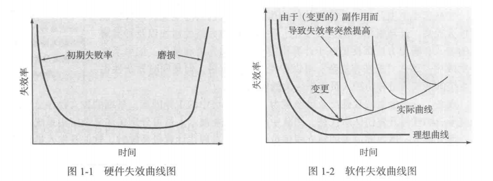

# 软件工程 实践者的研究方法

[TOC]

| 日期     | 进度                                | 复习总结 |
| -------- | ----------------------------------- | -------- |
|          |                                     |          |
|          |                                     |          |
| 10月16日 | 2.3 软件工程实践 - 3.2 定义框架活动 |          |
| 10月23日 | 3.3 明确任务集 - 3.5 过程评估与改进 |          |

## 第 1 章 软件的本质 [:arrow_right:](# 软件工程 实践者的研究方法)

随着时间的推移，将有数百万的计算机程序需要进行==纠错（corrected）==、==适应性调整（adapted）==和==优化（enhancement）==，这些维护工作将耗费比开发新软件更多的人力和物力。

### 1.1 软件的本质

#### 1.1.1 定义软件

==软件==是：

1. **指令的集合（计算机程序）**，通过执行这些指令可以满足预期的特性、功能和性能需求。
2. **数据结构**，使得程序可以合理利用信息。
3. **软件描述信息**，它以硬拷贝或虚拟形式存在，用来描述程序的操作和使用。

未知的缺陷将会在程序生命周期的前期造成高失效率。随着错误的纠正，曲线将如图1-2中所示趋于平缓。曲线的含义：**软件不会磨损**（==本质特点==），但==退化==确实存在。

软件工程的目的是降低软件失效曲线中曲线向上突变的幅度，以及实际失效曲线的斜率。

不断地变更是软件退化的根本原因。变更原因：⽤户需求变化；⽤户对需求的理解vs开发者对需求的理解。

硬件磨损可以用备用部件替换，而软件不存在备用部件。缺陷暗示：设计缺陷；设计->机器可执行代码过程中产生的错误。因此软件维护需要应对变更请求，比硬件维护更加复杂。

#### 1.1.2 软件应用领域 

软件的分类是人为的。用途、领域等。

今天，软件可以分为七大类：

1. 系统软件
2. 应用软件
3. 工程/科学软件
4. 嵌入式软件
5. 产品线软件
6. Web/移动APP
7. 人工智能软件

开发方法：

* 结构化开发方法（最小单位：函数）
* 面向对象开发方法（类）

#### 1.1.3 遗留软件

遗留软件的特点：

* 生命周期长（往往都是几十年前诞生的了）
* 业务关键性（曾不断被修改取满足商业需要和计算平台的变化，它们许多仍然支持核心商业功能，是业务不可缺少的支撑）
* 质量差（基于现代软件工程的评价标准）
  从软件的定义出发去看：
  * 设计难以拓展（data）
  * 代码令人费解（Program）
  * 文档缺失或混乱（document）

> 如果遇到质量低下的遗留软件怎么办？

考虑到其业务关键性，我们仍然需要做出应对。可以在其发生重大变更前什么也不做，可满足用户需求且可运行，则未失效，不需修改。

随着时间推移，遗留系统发生演化的原因：

1. 软件需适时调整—>满足新的计算环境或技术的需求。
2. 软件升级—>实现新的商业需求。
3. 软件扩展—>具备更多与新系统和数据库的互操作能力。
4. 软件架构改建—>适应不断演化的计算环境。

> 对遗留软件进行了哪些类型的改变？

变更不可避免，不应反对变更。

### 1.2 软件的变更本质

四大类软件不断演化，在行业中占主导地位，这四类软件前十几年还处于初级阶段。

#### 1.2.1 WebApp

#### 1.2.2 移动App

App演化为—>在移动平台上专门设计的软件。一般移动App包括用户接口，用户接口可以利用移动平台提供的独特的交互机制，基于Web资源的互操作性 提供与App相关的大量信息访问，并具有本地处理能力，以最适合移动平台的方式收集、分析和格式化信息，并提供在平台中持久

> WebApp和移动App之间的差别是什么？

#### 1.2.3 云计算

开发式软件很复杂，功能强大。

三层架构没有明显边界

IaaS—Infrastructure as a Service 资源层或基础设施层

PaaS—Platform as a Service 云平台核心层，主要功能是对虚拟机的资源状态进行监测、预警和优化决策。

1. 资源监测：实时监测当前各台虚拟机CPU、内存的使用情况，也监测用户需求，以便根据应用规模大小进行决策
2. 预警：根据当前需求预测下一秒需求量
3. 优化决策：预警之后，进行资源调度（迁移or伸缩），采用何种调度策略才能保证服务和资源利用率是研究重点。

SaaS—Software as a Service 给用户提供可视化界面，进行数据存储、操作选择的提供。。。（计算设备、存储、网络）通过互联网提供软件服务的软件应用模式。

#### 1.2.4 产品线软件

自阅读，参考

www//wiki.mblib.com

## 第2章 软件工程 [:arrow_right:](# 软件工程 实践者的研究方法)

关键词：框架活动 通用原则 原则 问题解决 SafeHome 软件工程（定义 层次 实践） 软件神话 软件过程 普适性活动

### 2.1 定义软件工程学科

==软件工程==是：

1. 将==系统化的==、==规范的==、==可量化的==方法应用于软件的开发、运行和维护，即将工程化方法应用于软件；
2. 对1.中所述方法的研究。

软件工程包括**过程**、一系列**方法（实践）**和大量**工具**，专业人员借由这些来构建高质量的计算机软件。

* 支持软件工程的根基在于==质量关注点（quality focus）==。

* **软件工程的基础是==过程层（process）==。**过程定义框架，软件过程构成了软件项目管理控制的基础。

* **软件工程==方法（method）==为构建软件提供技术上的解决方法。**方法覆盖面广，包括沟通、需求分析、设计建模、程序构造、测试和技术支持。软件工程方法依赖于一组基本原则。

* **软件工程==工具（tool）==为过程和方法提供自动化或半自动化的支持。**（大模型技术、集成化的框架、需求调研工具、文档管理工具、git协同协作管理等各种各样的工具）工具可以集成起来，使得一个工具产生的信息可以被另外一个工具使用，即建立软件开发支撑系统，称为**计算机辅助软件工程（computer-aided software engineering, CASE）**。

  > 软件过程的元素是什么？

代码评审（review）

代码检查（walkthrough）

### 2.2 软件过程

coding (activity or stage)

action: 

1. check detailed design specification (action)（检查详细设计语言）
2. interface definition (action)（接口端设计，调用接口定义清楚（对外接口，内部接口））
3. code (action)（结对编程）
4. code review (action)（准备工作：确认人员；预备工作：分发代码，预查看；评审会：组织，参与，代码审查；预评审；修改代码）

Umbrella activity（质量维，质量活动，普适性活动）

通过一些活动达到管理的目的，进而提高软件开发过程中的工作产品质量，软件的质量是在开发过程中形成的，

Framework activity(框架活动)

比如需求调研 

Development activity（开发维）

#### 2.2.1 过程框架（Process Framework）

1. **Communication 沟通**

   理解目标，收集需求，定义软件特性和功能。

2. **Planning(Umbrella activities) 策划**

   软件项目计划，定义和描述软件工程工作，包括需要执行的技术任务、风险、资源需求、工作产品、工作进度计划等。

3. **Modeling 建模**

   需求建模，设计建模

4. **Construction 构建**

   对设计进行构建，包括编码和测试（用于发现错误）

5. **Deployment 部署**

   软件（全部或者部分增量）交付给用户，用户对测评给出反馈意见。

   **不同软件过程的细节可能差别很大，但是框架活动基本一致。**

   对于许多软件项目来说，随着项目开展，框架活动可以迭代应用。即项目多次迭代过程中，上述5个活动不断重复，每次迭代都会产生**软件增量（software increment）**，每个软件增量实现部分软件特性和功能，使得软件逐步完善。

#### 2.2.2 普适性活动（Umbrella Activity）

==Umbrella activity==（质量维，质量活动，普适性活动）

通过一些活动达到管理的目的，进而提高软件开发过程中的工作产品质量，软件的质量是在开发过程中形成的。

**软件工程过程框架活动由很多普适性活动来补充实现。通常这些普适性活动贯穿软件项目始终，以帮助软件团队管理和控制项目进度、质量、变更和风险。**

* **软件项目跟踪和控制（Software project planning, tracking and control）**

* **风险管理（Risk management）**

  1. 识别风险

     * 相似以往的经历经验；
     * 头脑风暴
     * 专家系统

     识别风险最高的5个或10个。这个排行怎么选？风险曝光度=风险发生概率(0~1)×风险发生后的损失(统一的评估，比如1-10)，根据发现曝光度排序，选出前5前10，排名靠前的需要多观察识别

  2. 风险管理，risk avoiding 风险规避，风险缓解

  3. 风险跟踪，风险需要不断跟踪，至每个activity做完，得到跟踪结果，分析跟踪结果。

* **软件质量保证（Software quality assurance, SQA）**
  确定和执行保证软件质量的活动。
  
* **技术评审（Technical reviews）**
  评估软件工程产品，尽量在错误传播到下一个活动之前发现并清除错误。
  formal, informal，正式与非正式，个人评审和小组评审，质量保证可能随时随地抽查，可能是工作产品还没做完或者某个规约还没有达成就检查，review则是某阶段或某段代码某个需求规约完成了，再一并评审，比如需求规约完成了，评审负责人从头到尾开会评审，给出意见；如果发生严重问题，可能还需re-review，审计检查。review通过之后，说明某个需求规约可以交由下一个需求建模使用了（达成里程碑）。
  
* **测量（Measurement）**
  定义和收集过程、项目以及产品的度量，以帮助团队在发布软件时满足利益相关者的要求。比如项目需要两周时间，跟踪进度，测量进度和预期比提前还是延后。
  
* **软件配置管理（Software configuration management）**
  配置项，配置管理的一个最小的独立单元/单位，凡是纳入配置管理范畴的工作成果都统称为配置项。两大类：一类属于生产产品的部分，如需求文档、设计文档、源代码、测试用例等等；另外一类是在管理过程中产生的文档，如各项计划报告。每个配置项主要属性有名称、标识符、文件状态、版本、作者、日期等，配置项可以反映软件的演化过程。
  整个软件过程中管理变更带来的影响。版本分支，分支开发，项目发布等需要用到。
  
* **可复用管理（Reusability management）**
  定义工作产品复用的标准（包括软件构件），并建立构件复用机制。类的标准化，类库。复用机制，怎么实现怎么定义这些类，有一个指南。分支概念也是用到了复用的思想，比如上海要用某软件1.0功能，直接复用不行，可以修改一点变成上海适用的1.0.1版本等，减少开发成本.
  
* **工作产品的准备和生产（Work product preparation and production）**
  包括生成产品（建模、文档、日志、表格、列表等）所必须的活动。

> 普适性活动贯穿整个软件过程，主要关注项目管理、跟踪和控制。

#### 2.2.3 过程的适应性调整 Process Adaptation

软件工程过程应该是**灵活可适应**的。not a rigid prescription that must be followed dogmatically by s software team.

dogmatically 有意思

可以体现在以下方面：

* SQA应用方式；
* activity, action, task的总体流程和相互依赖关系；
* 工作产品的定义和要求的程度；
* 每个框架活动中，动作和任务细化的程度；
* 项目跟踪和控制活动应用的方式；
* 过程描述的详细程度和严谨程度；
* 客户和利益相关者对项目的参与程度；（比如公司要做一个项目，但是不知道市场适用性也没有需求和具体要求，那可以根据自主情况和认知来做产品）
* 软件团队所赋予的自主权；
* 队伍组织和角色的明确程度；（比如团队有经验，组会间隔拉长等）

> 对软件过程的适用性调整是项目成功的关键。

也许我可以理解成这样：Umbrella Activity是一种普适性、总体上的活动，在软件开发过程中最好是能够按步执行这些活动，以保证软件质量；而适用性调整是对不同软件项目的一种针对性特化，不同的软件开发在具体实现和实践上需要有不同的要求，以保证软件开发的灵活性。

### 2.3 软件工程实践 Software engineering practice

通用的框架活动：沟通、策划、建模、构建、部署和普适性活动。->构成软件工程体系结构轮廓

在实际过程中怎么应用、怎么做。软件工程的实践怎么融入该框架？

> It’s sometimes difficult to admit, but most of us suffer from hubris when we’re presented with a problem. We listen for a few seconds and then think, 
>
> *Oh yeah, I understand, let’s get on with solving this thing.* 
>
> Unfortunately, understanding isn’t always that easy.

#### 2.3.1 实践的精髓

1. **理解问题（沟通，分析，communication, analysis）**

   利益相关者？哪些是未知的？数据、功能、特性哪些是解决问题必须的？

   问题是否可划分？问题能否图形化？（想到统计分析与建模课上，高珍老师说先一步图形化可以帮助我们对问题有个形象化一点的认识，让问题比较容易浮现思路）

   能否建立分析模型？（分析模型：主要矛盾以及可能解决方案）

2. **策划解决方案（建模和软件设计）**

   需求调研->分析建模

   概要设计（数据库等）详细设计

3. **实施计划（代码生成）**

   coding->review（模块、类、微服务、方法）

4. **检查结果正确性（测试和质量保证）**

   设计足够的测试来发现尽可能多的错误。

#### 2.3.2 通用原则 General Principles

1. 存在价值 The reason it all exists.

2. 保持简洁 KISS, Keep it simple, stupid!

3. 保持愿景 Maintain the vision 可视保持

4. 关注使用者 What you produce, others will consume

5. 面向未来 Be open to the future

6. 提前计划复用 Plan ahead of reuse 系统可扩展性

   降低开发费用，增加可复用构件以及构件化系统的价值

7. 认真思考 Think!

Hooker 的七条简单原则，可以使得开发复杂的计算机软件系统的许多困难迎刃而解。

### 2.4 软件开发神话

Software myths—erroneous beliefs about software and the process that is used to build it—can be traced to the earliest days of computing. 软件神话——关于软件和软件构建过程的错误观念——可以追溯到计算机发展的早期。

具有一些特点：不可捉摸；符合直觉；常被有经验的从业人士宣传；

==管理神话==

神话：拥有

神话：为了赶上进度增加人手。

事实：为赶进度而增加人手只会使得进度更加延误；计划且有序，增员才有意义。

神话：外包撒手不必管。

事实：需要定时报告进展，需要了解内部管理和控制软件项目。

==客户神话==

导致客户错误的期望，最终导致对开发者的不满。

神话：对项目目标大致了解即可开始编程，之后项目开发中充实细节。

事实：模糊不清的描述会给项目带来灾难。

神话：需求变更但软件弹性，因此容易适应变更。

事实：引入时机不同，变更影响不同。

==从业者神话==

神话：交付之后，任务完成。

事实：编程开始早，耗费时间长。

神话：程序运行才可以评估其质量。

事实：技术评审可以从项目启动开始实行。

神话：一个成功的软件项目，可执行程序是唯一的可交付工作成果。

事实：软件配置包括可执行程序。各种工作产品是成功实施软件工程的基础，为软件技术提供指导。

神话：软件工程导致大量无用文档产生，因此降低工作效率。

事实：好的质量减少返工，加快交付。

# Part 1. 软件过程

## 第 3 章 软件过程结构 [:arrow_right:](# 软件工程 实践者的研究方法)

### 3.1 通用过程模型

需求调研

需求分析建模

概要设计建模 high level

组件设计 详细设计

coding

test单元集成系统

维护

基于通用模型的一些流

基本开发流在实际开发中会演化为多种多样的开发流，过程适应项目实际需求

### 3.2 定义框架活动

针对给定的问题、开发人员和利益相关者，那些action适合于框架活动

先关注activity->action->task后关注action和task

需求调研，一个action拆分成四个task

1. Make contact with stakeholder via telephone.
2. Discuss requirements and take notes.

3. Organize notes into a brief written statement of requirements.
4. E-mail to stakeholder for review and approval.

### 3.3 明确任务集

定义任务的一个例子：

需求分级并且划定不确定域；

上述两种任务集都可以完成任务获取，但是在深度和形式上有很大区别。

怎么管理Activity，实际怎么操作

甘特图 MS Project

### 3.4 过程模式 Process Patten

检查详细设计是否完整，是否经过严格评审，是否修改，是否是可用版本。

==过程模式==提供了一种模板：**一种在软件过程的背景下统一描述问题解决方案的方法。**

==过程模式描述了软件工程工作中遇到的过程相关的问题，明确了问题环境并给出了针对该问题的一种或几种可证明的解决方案。==

我们可以在不同抽象层面上定义模式。

> 模式的重复与软件模块的重复完全不同，不同的模块是独特的，而模式却是相同的。
>
> 
>
> 这句话强调了"模式"和"软件模块"之间的不同。让我详细解释一下这个观点：
>
> 1. **模式的重复**：
>    - "模式"在软件工程中通常指的是经验丰富的开发人员在解决特定问题时积累的一种解决方法或设计方法。这些模式是一种被认可的、经过验证的最佳实践，可用于解决一类特定问题，例如，单例模式、工厂模式、观察者模式等。
>    - 这些模式是相对不变的，不会随着具体项目的不同而发生大的变化。因为它们已经被证明在许多情境下非常有效，所以可以被多次重复应用到不同的软件项目中。
>    - 换句话说，无论你是在开发一个社交媒体应用还是一个电子商务网站，相同的模式（比如MVC模式）可以用来解决特定类型的问题。
>
> 2. **软件模块的重复**：
>    - "软件模块"指的是构成软件系统的各个部分或组件，这些模块执行特定的功能。每个模块在不同的软件项目中可能会有不同的实现，因为它们需要根据具体的需求和功能来定制。
>    - 不同的软件模块通常是针对特定项目而设计的，因此它们在不同的上下文中可能会有不同的逻辑和实现。
>    - 换句话说，虽然在一个项目中你可能有一个处理用户认证的模块，但在另一个项目中，同样的功能可能需要不同的实现。
>
> 综上所述，这句话的关键观点在于，软件开发中存在两种不同类型的重复性：
>
> - **模式的重复**：这是在不同项目中**可以反复使用的通用解决方案**，因为它们已经被证明是有效的。
> - **软件模块的重复**：这是在不同项目中为了**满足特定需求而创建的、相对特定的组件或模块**，它们在不同项目中可能会有不同的实现。
>
> 理解这一区别有助于开发人员更好地利用模式来提高代码质量和开发效率，同时也能够意识到在软件模块层面需要根据项目需求进行适度的自定义。

> 模式模板提供了描述模式的一般性方法。

**过程模式描述模板：**

1. **模式名称。**
2. **驱动力。**模式使用环境以及主要问题。
3. **类型。**
   1. 步骤模式 stage patten，定义了与过程的框架活动相关的问题。
   2. 任务模式 task patten，也可以加一个action patten，定义了与软件工程动作action或者是工作任务task相关、关系软件工程时间成败的问题。
   3. 阶段模式 phase patten/process patten，定义在过程中发生的框架活动序列。
4. **启动条件。**执行这个 patten 之前，有哪些前置工作要完成，是否全部完成，哪些没有完成。前提条件。已有哪些活动？进入状态是什么？已经有哪些软件工程信息或项目信息？
5. **问题。**模式要解决的具体问题。
6. **解决方案。**如何成功实现模式。
7. **结果。**感觉和启动条件是对应的：必须完成哪些活动？过程结束状态是什么？产生了哪些软件工程信息或项目信息？
8. **相关模式。**嵌套的相关patten
9. **已知应用和实例。**该模式可应用的具体实例。

过程模式一旦建立起来，就可以进行复用以定义各种过程变体，即软件开发团队可以将模式作为过程模型的构建模块，定制特定的过程模型。

> 练习：讨论下列例子。
> 
>
> 模式：需求不清
>
> 目的：stakeholders可以识别确定需求
>
> 类型：阶段模式
>
> 启动条件：利益相关者确定；沟通方式建立；明确需解决的主要问题；项目基本情况、约束有初步了解；
>
> 问题：需求模糊或不存在；需求无法详细描述；
>
> 解决方案：描述了原型开发过程；
>
> 结果：开发软件原型，识别基本需求；->原型系统最终演化为软件产品，或被抛弃后采用其他过程模式建立软件产品；
>
> 相关模式：客户沟通、迭代设计、迭代开发、客户评价、需求抽取……
>
> 已知应用和实例：需求不明确，推荐原型开发

### 3.5 Process Assessment and Improvement

过程模型评估与改进，是否适用，有哪些不足，怎么改进，实施中改进or下一个类似项目中改进。

有一系列不同的方法去评估和改进软件过程：

* SCAMPI Standard CMMI Assessment Method for Process Improvement
* CBAIPI CMM-Based Appraisal for Internal Process Improvement
* 上面两个比较常用
* SPICE
* ISO 9001:2000 for Software

==软件成熟度模型CMM(I)==

SEI 软件工程研究所，收集各军方大型开发框架，标准化，民用化，变成了标准化的软件开发评估SW-CMM(I) software-capability maturity model, integration（CMM之后拓展，将原来的级别做了改动，增设软件售前售后；售前，硬件插件软件等产品的采购->怎么高效进行和管理？售后，产品销售与迭代升级；大致两种：stage阶段式的，还有continue连续式的）

软件工程能力控制水平，级别高水平高，改进能力和过程能力高

下面是5个level及其KPA（Key Process Area）

1. **level 1 initial**

2. **level2 repeatable** CMM2

   很多方法可重复使用，what to do -> how to do

   how to do

   规则：guidelines template 定义一些规则、引导、指南，文档形式存在；详细目录，

   工具：寻找一些工具，可能是开源的来支撑；

   监控：monitor and control

   认证之后颁发CMM2级证书

   标准

   * Requirement management 需求管理
   * Software project planning 软件项目规划
   * Software project tracking & oversight 软件项目跟踪和监督
   * Software subcontract management 软件子合同管理
   * Software quality assurance 软件质量保证（umbrella activity）
   * Software configuration management 软件配置管理
     * 配置管理计划模板，怎么定义配置项，工具git，配置项是不是符合要求，有没有出现混乱的现象；

3. **level3 defined** CMM3

   文档规范

   * Organization process focus 组织过程重点
   * Organization process definition 组织过程定义
   * training program 培训计划
   * Integrated software management 综合软件管理
   * Software Product engineering 软件产品工程
   * Intergroup coordination 小组间协调
   * Peer reviews 同行评审

4. **level4 managed** CMM4

   定量，不但定义，还可以动态优化和管理，可管理级

   * Software quality management 软件质量管理
   * Quantitative process management 量化过程管理

5. **level5 optimized **CMM5

   敏捷度，优化级，不但可以管理，还可以优化，形成固定的方法学

   * Defect Prevention 缺陷预防
   * Technology change management 技术更新管理
   *  Progress change management 过程更改管理

   CMMI建议泛读，

## 第 4 章 过程模型 [:arrow_right:](# 软件工程 实践者的研究方法)

### 4.1 惯用/具体过程模型 Prescriptive Process Models

每个过程模型还定义了**过程流（工作流）**——过程元素相互之间的关联方式

#### 4.1.1 The Waterfall Model 瀑布模型

又叫==经典生命周期==，或者==线性过程模型==。

尽量不要迭代不要回溯，属于理想化的做法，软件工程最早的范例，早期的开发中需求比较清楚（当从沟通到部署都采用合理的线性工作流方式时，可以清楚地理解问题的需求）

function point

use-case point

V Model 对软件工程发展起到重要作用

requirement analysis modeling

high level design

detailed design

微模型出现极大推动软件测试技术发展

特点：

1. 需求明确
2. 极少迭代
3. 长时间才得到成品
4. 为微模型理论发展起到重要推动作用
5. blocking states 由于任务之间的依赖性，在某些项目中会出现“阻塞状态”。

#### 4.1.2 Increment Process Model 增量过程模型

每个增量相当于一个waterfall，

比如原来按照瀑布模型，两年出成品，现在用增量模型，第一个增量出来，半年内出来核心部分可以给到用户去使用，每个增量团队可能执行一个小的waterfall process model，

流水线？哈哈哈

特点：

1. 一般每一次增量都是一个小的瀑布模型；
2. 第一次增量一般发布最核心功能；（core product）
3. 每次增量可能存在交叉（时间上，功能上有没有交叉？）
4. 每一次增量都是一个可发布版本，后面的是前面的增量的加强和完善；
5. 中型项目一般小于等于五次，敏捷开发是在增量模型的基础上发展出来的；
6. 增量每次增加的需求是固定的，比如每次加三四个（比如上图每个瀑布模型之间的高度差基本一致，即功能增量基本一致）

#### 4.1.3 Evolutionary Process Model 演化模型

不要求需求特别明确；前两个模型要求比较明确；

**（一）原型模型** Prototyping model

客户定义了软件的基本任务，但是没有详细定义功能和特性需求。

开发人员可能对算法效率、操作系统的适用性和人机交互形式等情况没有把握。

### 4.2

### 4.3

### 4.4

### 4.5

### 4.6

### 4.7
